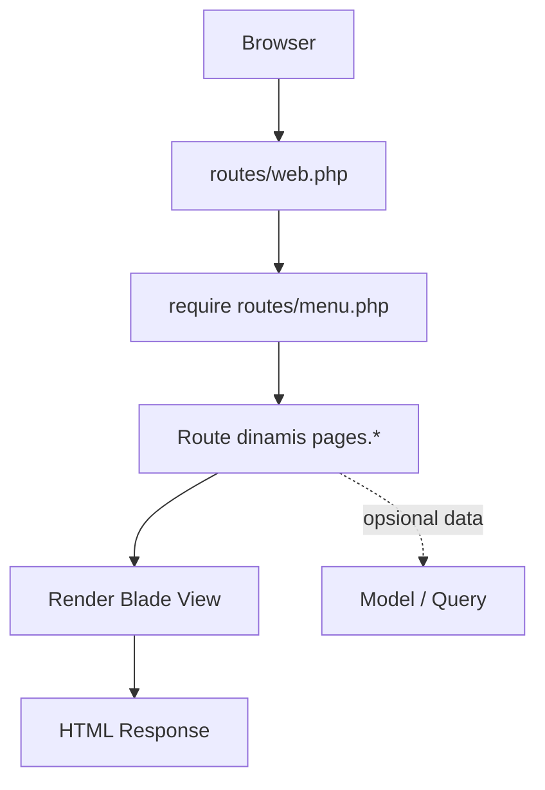

# Panduan Arsitektur MVC - Metronic Laravel 12

Dokumen ini menjelaskan alur **Model-View-Controller (MVC)** yang benar-benar dipakai di project ini.

## Mini Table of Contents

- [1. Gambaran Umum Arsitektur](#mvc-bab-1)
- [2. Routing (Entry Point)](#mvc-routing)
- [3. Controller (C pada MVC)](#mvc-controller)
- [4. View (V pada MVC)](#mvc-bab-4)
- [5. Model (M pada MVC)](#mvc-bab-5)
- [6. Middleware dan Proteksi Akses](#mvc-bab-6)
- [7. Menambah Halaman Baru (Tanpa Tambah Route Manual)](#mvc-bab-7)
- [8. Menambah Fitur CRUD (Rekomendasi Real)](#mvc-crud)
- [9. Ringkasan Aturan Praktis](#mvc-bab-9)

<a id="mvc-bab-1"></a>
## 1. Gambaran Umum Arsitektur

Project ini menggabungkan:
- Route statis/aksi di `routes/web.php`
- Route dinamis berbasis file view di `routes/menu.php`
- Blade view di `resources/views/pages/**`
- Model Eloquent di `app/Models/**`

Alur request utamanya:



Ringkasan cepat di README:
- [README - Alur MVC](./README.md#readme-mvc)
- [README - MVC Routing](./README.md#readme-mvc-routing)
- [README - MVC Controller](./README.md#readme-mvc-controller)
- [README - MVC CRUD](./README.md#readme-mvc-crud)

<a id="mvc-routing"></a>
## 2. Routing (Entry Point)

### `routes/web.php`

File ini menangani route utama aplikasi, misalnya:
- `/` -> `welcome`
- `/dashboard` -> `dashboard` (middleware `auth`, `verified`)
- `/profile` (edit/update/delete) via `ProfileController`
- switch language (`/lang/{locale}`)
- switch theme version (`/theme/version/{version}`)

Di bagian bawah, file ini me-load:

```php
require __DIR__ . '/menu.php';
```

### `routes/menu.php` (Routing Dinamis)

File ini melakukan scan semua file:
- `resources/views/pages/**/*.blade.php`

Lalu otomatis membuat route:
- URL: berdasarkan path file (format slash)
- Name: berdasarkan path file (format titik)
- View: `pages.{routeName}`

Contoh:

```text
resources/views/pages/help/pemrograman/skema/route.blade.php
=> URL: /help/pemrograman/skema/route
=> name: help.pemrograman.skema.route
=> view: pages.help.pemrograman.skema.route
```

Semua route dinamis ini berada dalam middleware `auth`.

<a id="mvc-controller"></a>
## 3. Controller (C pada MVC)

Saat ini controller yang dipakai jelas di route utama adalah:
- `app/Http/Controllers/ProfileController.php`

Catatan penting:
- Project ini **tidak** memakai `RoutingController` untuk mapping view dinamis.
- Mapping halaman `pages/*` dilakukan langsung oleh closure route di `routes/menu.php`.

Kapan menambah controller baru?
- Saat ada proses bisnis (simpan data, validasi kompleks, API, export/import, dsb).
- Jangan memindahkan mapping route dinamis ke controller jika tujuannya hanya render view statis.

<a id="mvc-bab-4"></a>
## 4. View (V pada MVC)

View menggunakan Blade, lokasi utama:
- `resources/views/layouts/**` untuk shell/layout global
- `resources/views/layouts/partials/**` untuk bagian reusable (sidebar, header, footer, dsb)
- `resources/views/pages/**` untuk halaman konten

Pola render route dinamis:
- URL `/a/b/c` -> cari `resources/views/pages/a/b/c.blade.php`

Jika tidak ada route yang cocok, fallback diarahkan ke:
- `pages.pages.authentication.general.error-404`

<a id="mvc-bab-5"></a>
## 5. Model (M pada MVC)

Model berada di:
- `app/Models/**`

Model default:
- `app/Models/User.php`

Seeder user development:
- `database/seeders/DatabaseSeeder.php` membuat `test@example.com`
- Password default factory: `password` (`database/factories/UserFactory.php`)

<a id="mvc-bab-6"></a>
## 6. Middleware dan Proteksi Akses

Proteksi utama:
- Route dinamis pages di `routes/menu.php` dibungkus middleware `auth`
- Route `/dashboard` memakai `auth` + `verified`

Implikasi:
- User harus login untuk mengakses halaman di `resources/views/pages/**`
- Halaman publik tetap bisa didefinisikan di `routes/web.php` jika dibutuhkan

<a id="mvc-bab-7"></a>
## 7. Menambah Halaman Baru (Tanpa Tambah Route Manual)

Langkah:
1. Buat file Blade di `resources/views/pages/...`
2. Ikuti struktur folder yang sesuai URL
3. Akses URL-nya langsung

Contoh:
1. Buat file `resources/views/pages/reports/daily.blade.php`
2. Akses `/reports/daily`
3. Route name otomatis: `reports.daily`

<a id="mvc-crud"></a>
## 8. Menambah Fitur CRUD (Rekomendasi Real)

Untuk CRUD, gunakan route/controller spesifik di `routes/web.php`, misalnya:

```php
use App\Http\Controllers\ProductController;

Route::middleware('auth')->group(function () {
    Route::resource('products', ProductController::class);
});
```

Kenapa tetap disarankan resource/controller?
- Validasi request lebih rapi
- Otorisasi lebih mudah
- Maintainability lebih baik dibanding mengandalkan view dinamis murni

Catatan:
- Route spesifik (seperti `products/*`) tetap aman berdampingan dengan route dinamis dari `routes/menu.php`.

<a id="mvc-bab-9"></a>
## 9. Ringkasan Aturan Praktis

1. Halaman view biasa: taruh di `resources/views/pages/**` (route otomatis).
2. Proses bisnis/CRUD/API: buat controller + route spesifik.
3. Simpan menu di file config menu (`config/sidebar/*`, `config/header/*`) dan arahkan ke `route` name yang benar.
4. Jika ubah struktur view, cek ulang hasil route dengan:

```bash
php artisan route:list
```
