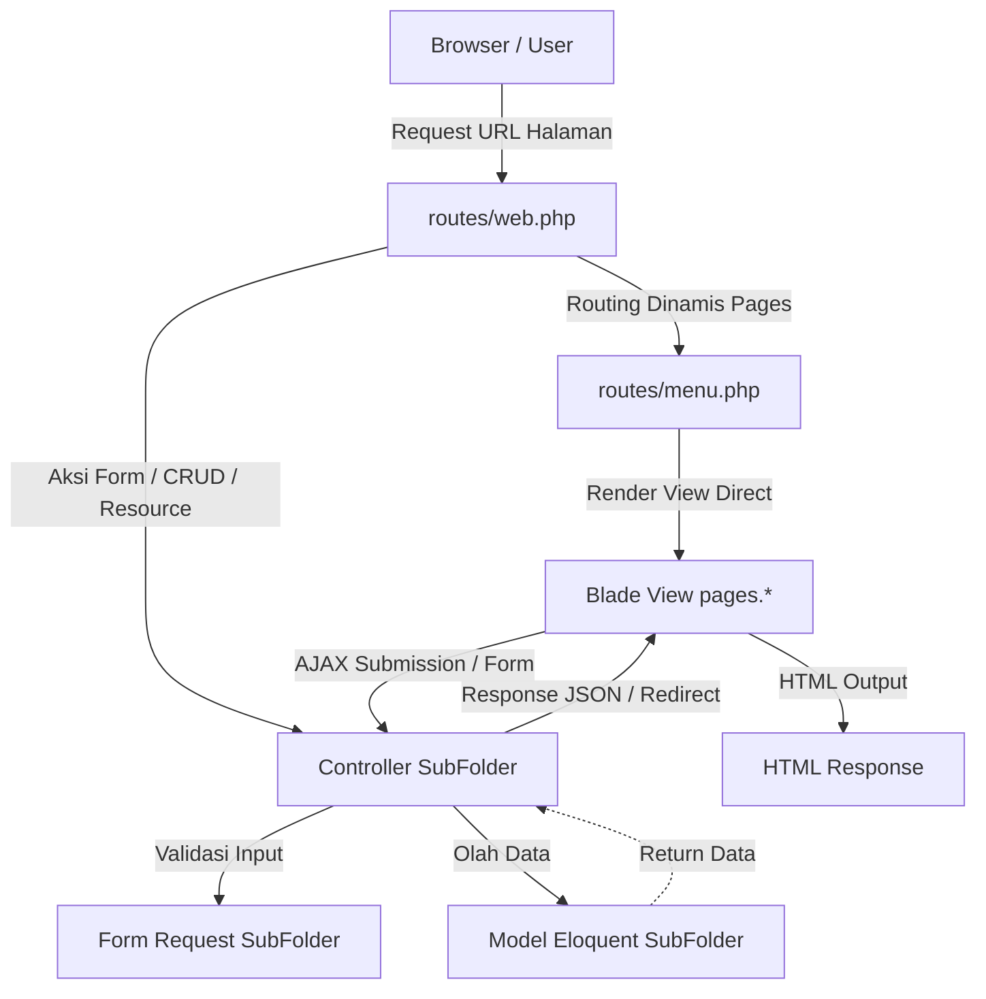

# Panduan Arsitektur MVC - Metronic Laravel 12

Dokumen ini menjelaskan alur **Model-View-Controller (MVC)** dan konvensi arsitektur yang dipakai di project ini.

## Mini Table of Contents

- [1. Gambaran Umum Arsitektur](#mvc-bab-1)
- [2. Routing (Entry Point)](#mvc-routing)
- [3. Controller & Form Request (C pada MVC)](#mvc-controller)
- [4. View & Multi-Tab (V pada MVC)](#mvc-bab-4)
- [5. Model (M pada MVC)](#mvc-bab-5)
- [6. Middleware dan Proteksi Akses](#mvc-bab-6)
- [7. Menambah Halaman Baru (Tanpa Tambah Route Manual)](#mvc-bab-7)
- [8. Menambah Fitur CRUD (Structure Mirroring)](#mvc-crud)
- [9. Ringkasan Aturan Praktis](#mvc-bab-9)

<a id="mvc-bab-1"></a>
## 1. Gambaran Umum Arsitektur

Project ini menggabungkan:
- Route statis/aksi di `routes/web.php`
- Route dinamis berbasis file view di `routes/menu.php`
- Blade view & subfolder partials/tabs di `resources/views/pages/**`
- Structure Mirroring Controller (`app/Http/Controllers/<SubFolder>/*`), Form Request (`app/Http/Requests/<SubFolder>/*`), dan Model Eloquent (`app/Models/<SubFolder>/*`)

Alur request utamanya:


```mermaid
graph TD
    A[Browser / User] -->|Request URL Halaman| B[routes/web.php]
    B -->|Routing Dinamis Pages| C[routes/menu.php]
    C -->|Render View Direct| D[Blade View pages.*]
    
    B -->|Aksi Form / CRUD / Resource| E[Controller SubFolder]
    E -->|Validasi Input| F[Form Request SubFolder]
    E -->|Olah Data| G[Model Eloquent SubFolder]
    G -.->|Return Data| E
    E -->|Response JSON / Redirect| D
    
    D -->|AJAX Submission / Form| E
    D -->|HTML Output| H[HTML Response]
```

Ringkasan cepat di README:
- [README - Alur MVC](./README.md#readme-mvc)
- [README - MVC Routing](./README.md#readme-mvc-routing)

<a id="mvc-routing"></a>
## 2. Routing (Entry Point)

### `routes/web.php`

File ini menangani route utama aplikasi, misalnya:
- `/` -> `welcome`
- `/dashboard` -> `dashboard` (middleware `auth`, `verified`)
- `/profile` (edit/update/delete) via `ProfileController`
- Switch language (`/lang/{locale}`)
- Endpoint aksi CRUD spesifik me-refer ke Controller di subfolder ter-mirror

Di bagian bawah, file ini me-load:

```php
require __DIR__ . '/menu.php';
```

### `routes/menu.php` (Routing Dinamis)

File ini melakukan scan semua file:
- `resources/views/pages/**/*.blade.php`

Lalu otomatis membuat route:
- URL: berdasarkan path file (format slash `/`)
- Name: berdasarkan path file (format titik `.`)
- View: `pages.{routeName}`

Contoh:

```text
resources/views/pages/help/pemrograman/skema/route.blade.php
=> URL: /help/pemrograman/skema/route
=> name: help.pemrograman.skema.route
=> view: pages.help.pemrograman.skema.route
```

Semua route dinamis ini berada dalam middleware `auth`.

<a id="mvc-controller"></a>
## 3. Controller & Form Request (C pada MVC)

Aturan utama pembuatan Controller:
- **Structure Mirroring**: Controller & Form Request **wajib dibuat di dalam subfolder yang mencerminkan hirarki View** di `resources/views/pages/`.
- Contoh: View `resources/views/pages/appsupport/app-profil.blade.php` 
  - Controller: `App\Http\Controllers\AppSupport\AppProfilController`
  - Form Request: `App\Http\Requests\AppSupport\AppProfilRequest`
  - Model: `App\Models\AppSupport\AppProfil`

Catatan penting:
- Project ini **tidak** memakai `RoutingController` untuk mapping view dinamis.
- Mapping halaman `pages/*` dilakukan langsung oleh closure route di `routes/menu.php`.
- Seluruh aturan validasi dikumpulkan dalam Form Request di `App\Http\Requests\<SubFolder>\<FeatureRequest>.php` untuk memisahkan logika validasi dari controller.
- Notifikasi respon AJAX 422 (validasi XHR) dan respon sukses/gagal diserahkan ke JavaScript helper global `SwalHelper`:
  - `SwalHelper.success(message)`
  - `SwalHelper.error(message)`
  - `SwalHelper.validationError(xhr)`
  - `SwalHelper.confirmDelete(itemName, callback)`

<a id="mvc-bab-4"></a>
## 4. View & Multi-Tab (V pada MVC)

View menggunakan Blade, lokasi utama:
- `resources/views/layouts/**` untuk shell/layout global
- `resources/views/layouts/partials/**` untuk bagian reusable (sidebar, header, footer, dsb)
- `resources/views/pages/**` untuk halaman konten utama
- `resources/views/pages/<subfolder>/partials/` untuk modal form & partial khusus fitur (`<feature>-form.blade.php`)
- `resources/views/pages/<subfolder>/tabs/<feature>/` untuk sub-tab multi-tab (`_{tab}.blade.php`)

### Arsitektur Multi-Tab Single Route (`?tab=...`)
- Untuk halaman dengan banyak sub-tab, gunakan 1 route utama dengan query parameter `?tab=...` (contoh: `/profil-pengguna?tab=pengaturan`).
- Hal ini menjamin status pencahayaan active menu sidebar tetap utuh pada route utama.
- Tab partials di-`@include` secara dinamis:
  ```php
  @include('pages.{subfolder}.tabs.{feature}._' . str_replace('-', '_', $activeTab))
  ```
- **Aturan Kebersihan Partial Tab**: Partial sub-tab tidak boleh mengandung `@extends`, `@section`, atau tag penutup container parent `</div>` yang prematur.

<a id="mvc-bab-5"></a>
## 5. Model (M pada MVC)

Model berada di:
- `app/Models/<SubFolder>/<Feature>.php` (mengikuti konvensi subfolder view ter-mirror)
- Model default: `app/Models/User.php`

Seeder user development:
- `database/seeders/UserSeeder.php` (dipanggil oleh `DatabaseSeeder.php`) membuat 3 akun default:
  - **Master**: `master@gmail.com` | Password: `password` | Role: `master`
  - **Admin**: `admin@gmail.com` | Password: `password` | Role: `admin`
  - **User**: `user@gmail.com` | Password: `password` | Role: `user`

<a id="mvc-bab-6"></a>
## 6. Middleware dan Proteksi Akses

Proteksi utama:
- Route dinamis pages di `routes/menu.php` dibungkus middleware `auth`
- Route `/dashboard` memakai `auth` + `verified`
- Otorisasi hak akses menggunakan Spatie Permission (`assignRole`, `hasPermissionTo`) dan Feature Toggle (`isFeatureActive()`).

Implikasi:
- User harus login untuk mengakses halaman di `resources/views/pages/**`.
- Halaman publik tetap didefinisikan di `routes/web.php` jika dibutuhkan.

<a id="mvc-bab-7"></a>
## 7. Menambah Halaman Baru (Tanpa Tambah Route Manual)

Langkah:
1. Buat file Blade di `resources/views/pages/...`
2. Ikuti struktur folder yang sesuai URL (format `kebab-case`).
3. Akses URL-nya langsung dari browser.

Contoh:
1. Buat file `resources/views/pages/reports/daily.blade.php`
2. Akses `/reports/daily`
3. Route name otomatis: `reports.daily`

<a id="mvc-crud"></a>
## 8. Menambah Fitur CRUD (Structure Mirroring)

Untuk fitur CRUD, buat arsitektur ter-mirror 4-layer dan daftarkan route aksi di `routes/web.php`:

### Pemetaan File:
1. **View Utama**: `resources/views/pages/appsupport/app-profil.blade.php`
2. **Form Partial**: `resources/views/pages/appsupport/partials/app-profil-form.blade.php`
3. **Controller**: `app/Http/Controllers/AppSupport/AppProfilController.php`
4. **Form Request**: `app/Http/Requests/AppSupport/AppProfilRequest.php`
5. **Model**: `app/Models/AppSupport/AppProfil.php`

### Definisi Route di `routes/web.php`:

```php
use App\Http\Controllers\AppSupport\AppProfilController;

Route::middleware('auth')->group(function () {
    Route::post('/appsupport/app-profil', [AppProfilController::class, 'update'])->name('appsupport.app-profil.update');
});
```

Keunggulan Pola Structure Mirroring:
- **Predictability**: Lokasi controller, model, dan form request langsung diketahui dari path view.
- **Clean Controller**: Penanganan validasi dipisahkan ke Form Request kelas khusus.
- **Standardized JS Notification**: Penggunaan `SwalHelper` memastikan notifikasi CRUD konsisten di seluruh aplikasi.

<a id="mvc-bab-9"></a>
## 9. Ringkasan Aturan Praktis

1. **Routing**: View statis/halaman biasa taruh di `resources/views/pages/**` (route otomatis dinamis).
2. **CRUD & Action**: Buat Controller, Model, dan Form Request di subfolder ter-mirror, lalu daftarkan route aksi di `routes/web.php`.
3. **Multi-Tab**: Gunakan query parameter `?tab=...` pada single route, simpan partial tab di `tabs/<feature>/_{tab}.blade.php`.
4. **Table Responsive**: Bungkus data table dengan `<div class="table-responsive">` dan gunakan min-width class Metronic (contoh: `<th class="min-w-150px">`).
5. **Form Validation**: Gunakan Form Request di `App\Http\Requests\<SubFolder>\*` dan tampilkan respon via `SwalHelper.validationError(xhr)`.
6. **Config Menu**: Daftarkan menu di `config/sidebar/*` atau `config/header/*` menggunakan route name yang cocok.
7. **Verifikasi Route**: Cek ulang route terdaftar menggunakan:
   ```bash
   php artisan route:list
   ```
