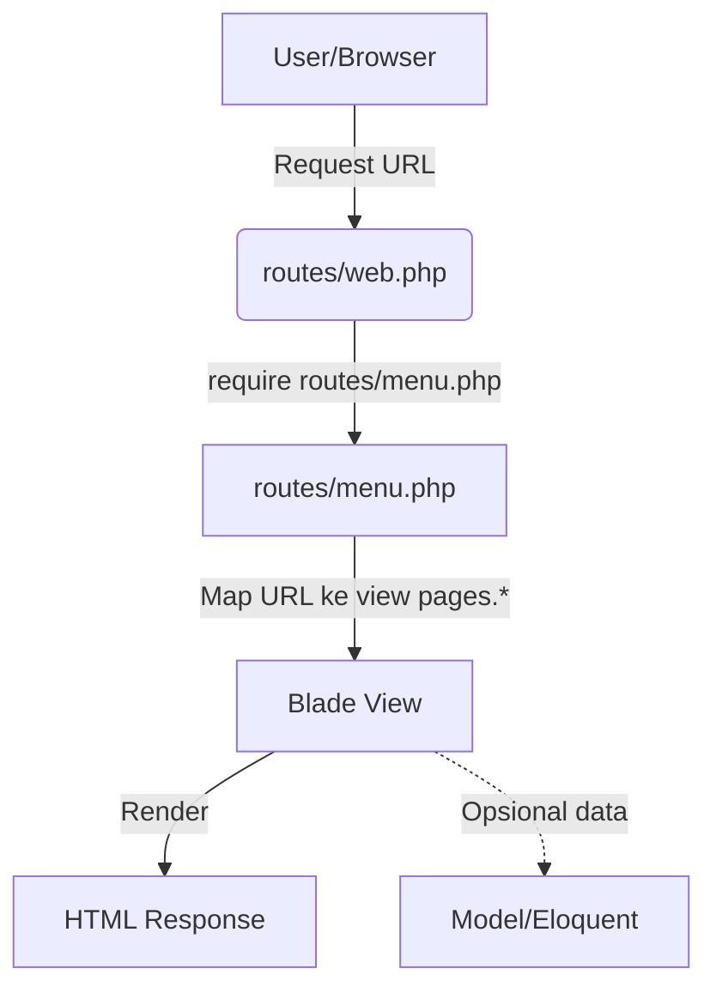

# Master Web Admin dengan Metronic 8.3.2 - Laravel 12

Project ini adalah implementasi Web Admin pada Laravel 12 dengan Template Metronic.

Repository:
`https://github.com/AbdoelMadjid/master-webadmin.git`

## Table of Contents

- [Requirement](#requirement)
- [1. Clone Project](#1-clone-project)
- [2. Install Dependency](#2-install-dependency)
- [3. Setup Environment](#3-setup-environment)
- [4. Konfigurasi Database](#4-konfigurasi-database)
- [5. Menjalankan Aplikasi](#5-menjalankan-aplikasi)
- [Opsi Setup Cepat](#opsi-setup-cepat)
- [Mode Development Sekali Jalan](#mode-development-sekali-jalan)
- [Testing](#testing)
- [Troubleshooting](#troubleshooting)
- [Akun Login Development](#akun-login-development)
- [Environment Variables Penting](#environment-variables-penting)
- [Deployment (Production) Singkat](#deployment-production-singkat)
- [Queue & Scheduler](#queue--scheduler)
- [Struktur Folder Views](#struktur-folder-views)
- [Alur MVC (Model-View-Controller)](#alur-mvc-model-view-controller)
- [Alur Route, URL Dinamis, dan Config Menu](#alur-route-url-dinamis-dan-config-menu)
- [Tutorial Singkat Skema Pemrograman](#tutorial-singkat-skema-pemrograman)
- [Akses dari aplikasi](#akses-dari-aplikasi)
- [Materi inti (sesuai menu sidebar)](#materi-inti-sesuai-menu-sidebar)
- [Materi operasional](#materi-operasional)
- [Referensi file konfigurasi menu](#referensi-file-konfigurasi-menu)
- [Validasi cepat route help](#validasi-cepat-route-help)

## Requirement

- PHP `>= 8.2`
- Composer `>= 2.x`
- Node.js `>= 18` (disarankan LTS terbaru)
- NPM
- MySQL/MariaDB

<div align="right"><a href="#table-of-contents" title="Back to Table of Contents">&#8679;</a></div>

## 1. Clone Project

```bash
git clone https://github.com/AbdoelMadjid/master-webadmin.git
cd master-webadmin
```

<div align="right"><a href="#table-of-contents" title="Back to Table of Contents">&#8679;</a></div>

## 2. Install Dependency

```bash
composer install
npm install
```

<div align="right"><a href="#table-of-contents" title="Back to Table of Contents">&#8679;</a></div>

## 3. Setup Environment

Salin file environment:

```bash
cp .env.example .env
```

Jika di Windows PowerShell:

```powershell
Copy-Item .env.example .env
```

Generate app key:

```bash
php artisan key:generate
```

<div align="right"><a href="#table-of-contents" title="Back to Table of Contents">&#8679;</a></div>

## 4. Konfigurasi Database

Edit `.env` bagian database:

```env
DB_CONNECTION=mysql
DB_HOST=127.0.0.1
DB_PORT=3306
DB_DATABASE=nama_database_anda
DB_USERNAME=root
DB_PASSWORD=
```

Lalu jalankan migrasi:

```bash
php artisan migrate
```

<div align="right"><a href="#table-of-contents" title="Back to Table of Contents">&#8679;</a></div>

## 5. Menjalankan Aplikasi

Jalankan backend Laravel:

```bash
php artisan serve
```

Jalankan Vite (asset frontend) di terminal lain:

```bash
npm run dev
```

Buka aplikasi:
`http://127.0.0.1:8000`

<div align="right"><a href="#table-of-contents" title="Back to Table of Contents">&#8679;</a></div>

## Opsi Setup Cepat

Project ini sudah punya script Composer `setup`:

```bash
composer run setup
```

Script ini akan:

- install dependency PHP
- membuat `.env` jika belum ada
- generate app key
- migrate database
- install dependency Node
- build assets production

<div align="right"><a href="#table-of-contents" title="Back to Table of Contents">&#8679;</a></div>

## Mode Development Sekali Jalan

Tersedia juga script:

```bash
composer run dev
```

Script ini menjalankan:

- `php artisan serve`
- queue listener
- laravel pail (log)
- `npm run dev`

<div align="right"><a href="#table-of-contents" title="Back to Table of Contents">&#8679;</a></div>

## Testing

```bash
php artisan test
```

<div align="right"><a href="#table-of-contents" title="Back to Table of Contents">&#8679;</a></div>

## Troubleshooting

- Jika style/js tidak update:
    - jalankan `php artisan optimize:clear`
    - restart `npm run dev`
- Jika error cache config/route/view:
    - `php artisan optimize:clear`
- Jika migrasi gagal:
    - cek kredensial DB di `.env`
    - pastikan database sudah dibuat

<div align="right"><a href="#table-of-contents" title="Back to Table of Contents">&#8679;</a></div>

## Akun Login Development

Data akun default berdasarkan seeder project saat ini (`database/seeders/DatabaseSeeder.php`):

```text
URL Login : http://127.0.0.1:8000/login
Email     : test@example.com
Password  : password
Nama      : Test User
```

Cara membuat akun ini:

```bash
php artisan migrate:fresh --seed
```

Catatan:

- Password `password` berasal dari default `UserFactory` (`database/factories/UserFactory.php`).
- Jika database sudah berisi data lama, gunakan `migrate:fresh --seed` hanya di environment local/dev.

<div align="right"><a href="#table-of-contents" title="Back to Table of Contents">&#8679;</a></div>

## Environment Variables Penting

Variabel minimum yang biasanya perlu disesuaikan:

```env
APP_NAME=Laravel
APP_ENV=local
APP_DEBUG=true
APP_URL=http://localhost

DB_CONNECTION=mysql
DB_HOST=127.0.0.1
DB_PORT=3306
DB_DATABASE=master-webadmin
DB_USERNAME=root
DB_PASSWORD=

QUEUE_CONNECTION=database
CACHE_STORE=database
SESSION_DRIVER=database

MAIL_MAILER=log
MAIL_HOST=127.0.0.1
MAIL_PORT=2525
MAIL_USERNAME=null
MAIL_PASSWORD=null
MAIL_FROM_ADDRESS="hello@example.com"
MAIL_FROM_NAME="${APP_NAME}"
```

Catatan:

- Nilai di atas mengikuti `.env.example` project ini.
- Untuk production, sesuaikan `APP_URL`, kredensial DB, dan SMTP asli server.

<div align="right"><a href="#table-of-contents" title="Back to Table of Contents">&#8679;</a></div>

## Deployment (Production) Singkat

Contoh alur deploy minimal di server production:

Command deploy final yang direkomendasikan untuk project ini:

```bash
git pull origin main
composer install --no-dev --optimize-autoloader
npm ci
npm run build
php artisan migrate --force
php artisan optimize:clear
php artisan optimize
```

Setup awal server (sekali saat provisioning):

```bash
cp .env.example .env
php artisan key:generate
php artisan storage:link
```

Checklist production:

- `APP_ENV=production`
- `APP_DEBUG=false`
- set permission folder `storage/` dan `bootstrap/cache/`
- konfigurasi web server (Nginx/Apache) mengarah ke folder `public/`

<div align="right"><a href="#table-of-contents" title="Back to Table of Contents">&#8679;</a></div>

## Queue & Scheduler

Konfigurasi real saat ini:

- Queue connection default: `database` (`.env.example` dan `config/queue.php`).
- Driver session/cache: `database`.
- Scheduler: belum ada task terdaftar (belum ada definisi schedule di project).

Command worker queue yang dipakai saat development (sesuai `composer run dev`):

```bash
php artisan queue:listen --tries=1 --timeout=0
```

Command worker queue untuk production (direkomendasikan):

```bash
php artisan queue:work --tries=3
```

Scheduler (opsional, jika nanti ada task) bisa disiapkan dari sekarang via cron:

```cron
* * * * * cd /path/to/project && php artisan schedule:run >> /dev/null 2>&1
```

Opsional dengan Supervisor (direkomendasikan production):

- Buat konfigurasi process `queue:work`
- Set `autostart=true` dan `autorestart=true`

<div align="right"><a href="#table-of-contents" title="Back to Table of Contents">&#8679;</a></div>

## Struktur Folder Views

Struktur utama folder Blade pada project ini:

```text
resources/views/
├── auth/                  # Halaman autentikasi (login, register, reset password, dst)
├── components/            # Komponen Blade reusable
├── layouts/               # Layout utama aplikasi
│   ├── header/            # Struktur header layout
│   └── partials/          # Partial layout (sidebar, footer, toolbar, docs, dll)
├── pages/                 # Seluruh halaman fitur
│   ├── apps/              # Halaman aplikasi (chat, e-commerce, dsb)
│   ├── dashboards/        # Halaman dashboard
│   ├── demo/              # Halaman demo Metronic
│   ├── docs/              # Halaman dokumentasi
│   ├── help/              # Help internal (termasuk Skema Pemrograman)
│   ├── layouts/           # Varian layout page-level
│   └── pages/             # Group halaman umum/metronic pages
├── partials/              # Widget/partial global reusable lintas halaman
└── profile/               # Halaman profil user
```

Catatan cepat:

- Tambah halaman baru umumnya di `resources/views/pages/...`.
- Shared widget/komponen sebaiknya di `resources/views/partials/...` atau `resources/views/components/...`.
- Perubahan struktur shell/layout global dikerjakan di `resources/views/layouts/...`.

<div align="right"><a href="#table-of-contents" title="Back to Table of Contents">&#8679;</a></div>

<a id="readme-mvc"></a>

## Alur MVC (Model-View-Controller)

Project ini menggunakan pola MVC Laravel dengan routing dinamis untuk halaman di folder `resources/views/pages`. Alurnya sebagai berikut:



### Penjelasan Singkat:

1. **Routing utama**: `routes/web.php` mendaftarkan route umum (`/`, `/dashboard`, auth, profile), lalu me-load `routes/menu.php`.
2. **Routing dinamis pages**: `routes/menu.php` scan seluruh file `resources/views/pages/**/*.blade.php`, lalu otomatis membuat:
    - URL path (format slash), contoh: `/help/pemrograman/skema/route`
    - route name (format titik), contoh: `help.pemrograman.skema.route`
3. **View (V)**: route dinamis langsung merender view `pages.*` via closure route (tanpa controller khusus untuk mapping halaman).
4. **Model (M)**: dipakai saat halaman butuh data dinamis, melalui Eloquent di `app/Models/*` atau layer service/query lain.
5. **Controller (C)**: tetap dipakai untuk endpoint yang memang berbasis aksi, contohnya `ProfileController` di `routes/web.php`.
6. **Middleware**: seluruh route dinamis pages berada di middleware `auth`, jadi hanya user login yang bisa mengaksesnya.
7. **Fallback**: jika route tidak ditemukan, aplikasi menampilkan view `pages.pages.authentication.general.error-404`.

### Cross-reference ke Panduan_MVC.md

<a id="readme-mvc-routing"></a>
**Routing**

- Ringkasan ada di section ini.
- Detail teknis ada di: [Panduan MVC - Routing (Entry Point)](./Panduan_MVC.md#mvc-routing)

<a id="readme-mvc-controller"></a>
**Controller**

- Ringkasan ada di section ini.
- Detail teknis ada di: [Panduan MVC - Controller](./Panduan_MVC.md#mvc-controller)

<a id="readme-mvc-crud"></a>
**CRUD**

- Ringkasan: untuk CRUD disarankan pakai controller + route spesifik/resource, bukan mengandalkan route view dinamis.
- Detail teknis ada di: [Panduan MVC - Menambah Fitur CRUD](./Panduan_MVC.md#mvc-crud)

Dokumen lengkap: [Panduan MVC Lengkap](./Panduan_MVC.md)

<div align="right"><a href="#table-of-contents" title="Back to Table of Contents">&#8679;</a></div>

## Alur Route, URL Dinamis, dan Config Menu

Ringkasan alur yang dipakai di project ini:

1. File Blade di `resources/views/pages/**` dibaca otomatis oleh `routes/menu.php`.
2. Path file dikonversi menjadi:
    - route name: format titik (`.`)
    - URL: format slash (`/`)
3. Config menu (`config/sidebar/*.php`, `config/header/*.php`) memanggil route tersebut lewat key `route`.
4. Renderer menu Blade (`layouts/partials/sidebar/_menu-item.blade.php`) menampilkan menu berdasarkan `route` atau `href`.

Contoh mapping otomatis (dari `routes/menu.php`):

```text
resources/views/pages/help/pemrograman/skema/route.blade.php
=> route name: help.pemrograman.skema.route
=> URL: /help/pemrograman/skema/route
=> view: pages.help.pemrograman.skema.route
```

Pola definisi menu di config:

```php
[
    'title' => 'Skema Route',
    'route' => 'help.pemrograman.skema.route', // route internal aplikasi
]

[
    'title' => 'Documentation',
    'href' => 'https://preview.keenthemes.com/html/metronic/docs', // link eksternal
]
```

Rule praktis:

- Gunakan `route` jika menu menuju halaman internal Laravel (lebih aman saat URL berubah).
- Gunakan `href` jika menu menuju URL absolut/eksternal.
- Pastikan route name di config sama dengan hasil generate route dinamis.

Referensi file:

- `routes/menu.php`
- `config/sidebar/_sidebar_helps.php`
- `config/header/_header_help.php`
- `resources/views/layouts/partials/sidebar/_menu-item.blade.php`

<div align="right"><a href="#table-of-contents" title="Back to Table of Contents">&#8679;</a></div>

## Tutorial Singkat Skema Pemrograman

Menu **Skema Pemrograman** tersedia di sidebar Help dan berisi panduan arsitektur project ini.

Dokumentasi versi Markdown (ringkas per submenu) tersedia di:

- [`docs/skema-pemrograman/README.md`](./docs/skema-pemrograman/README.md)
- Kelompok skema: [`docs/skema-pemrograman/skema/`](./docs/skema-pemrograman/skema/)
- Kelompok operasional: [`docs/skema-pemrograman/operasional/`](./docs/skema-pemrograman/operasional/)

Seluruh daftar di bawah diselaraskan dengan route help:

- `resources/views/pages/help/pemrograman/skema/*`
- `resources/views/pages/help/pemrograman/operasional/*`

<div align="right"><a href="#table-of-contents" title="Back to Table of Contents">&#8679;</a></div>

### Akses dari aplikasi

1. Buka aplikasi lalu login.
2. Masuk ke menu sidebar: `Help -> Skema Pemrograman`.
3. Halaman overview:
    - `/help/pemrograman/overview`

<div align="right"><a href="#table-of-contents" title="Back to Table of Contents">&#8679;</a></div>

### Materi inti (sesuai menu sidebar)

<table>
  <thead>
    <tr>
      <th width="38%">Judul</th>
      <th width="30%">Keterangan</th>
      <th width="17%">URL</th>
      <th width="15%">Dokumen</th>
    </tr>
  </thead>
  <tbody>
    <tr><td>Skema Route</td><td>Route halaman dibuat otomatis dari file Blade di folder <code>pages</code> dan dipakai oleh menu config.</td><td><code>/help/pemrograman/skema/route</code></td><td><a href="./docs/skema-pemrograman/skema/route.md">route.md</a></td></tr>
    <tr><td>Skema Layout</td><td>Struktur layout global, area konten, serta pemisahan partial agar reusable.</td><td><code>/help/pemrograman/skema/layout</code></td><td><a href="./docs/skema-pemrograman/skema/layout.md">layout.md</a></td></tr>
    <tr><td>Skema Komponen Blade & Partial</td><td>Konvensi penggunaan component dan partial untuk mengurangi duplikasi tampilan.</td><td><code>/help/pemrograman/skema/komponen-blade-partial</code></td><td><a href="./docs/skema-pemrograman/skema/komponen-blade-partial.md">komponen-blade-partial.md</a></td></tr>
    <tr><td>Skema Theme Assets</td><td>Resolver asset tema, pola versi aset, dan fallback aman saat upgrade.</td><td><code>/help/pemrograman/skema/theme-assets</code></td><td><a href="./docs/skema-pemrograman/skema/theme-assets.md">theme-assets.md</a></td></tr>
    <tr><td>Skema Auth dan Middleware</td><td>Flow login dan perlindungan akses route melalui middleware.</td><td><code>/help/pemrograman/skema/auth-dan-middleware</code></td><td><a href="./docs/skema-pemrograman/skema/auth-dan-middleware.md">auth-dan-middleware.md</a></td></tr>
    <tr><td>Skema Struktur Config Menu</td><td>Standar struktur array menu sidebar/header dan key yang dipakai.</td><td><code>/help/pemrograman/skema/struktur-config-menu</code></td><td><a href="./docs/skema-pemrograman/skema/struktur-config-menu.md">struktur-config-menu.md</a></td></tr>
    <tr><td>Skema Sidebar Menu</td><td>Cara build sidebar dari config dan penentuan active state.</td><td><code>/help/pemrograman/skema/sidebar-menu</code></td><td><a href="./docs/skema-pemrograman/skema/sidebar-menu.md">sidebar-menu.md</a></td></tr>
    <tr><td>Skema Header Menu</td><td>Pola menu header untuk route internal maupun URL eksternal.</td><td><code>/help/pemrograman/skema/header-menu</code></td><td><a href="./docs/skema-pemrograman/skema/header-menu.md">header-menu.md</a></td></tr>
    <tr><td>Skema Data Layer</td><td>Pola model, migration, query, dan pemisahan logic data dari view.</td><td><code>/help/pemrograman/skema/data-layer</code></td><td><a href="./docs/skema-pemrograman/skema/data-layer.md">data-layer.md</a></td></tr>
    <tr><td>Skema Error Handling & Fallback</td><td>Fallback 404 dan penanganan error supaya UX tetap konsisten.</td><td><code>/help/pemrograman/skema/error-handling-dan-fallback</code></td><td><a href="./docs/skema-pemrograman/skema/error-handling-dan-fallback.md">error-handling-dan-fallback.md</a></td></tr>
    <tr><td>Skema Cache & Deployment</td><td>Strategi cache command dan urutan deploy yang minim risiko.</td><td><code>/help/pemrograman/skema/cache-dan-deployment</code></td><td><a href="./docs/skema-pemrograman/skema/cache-dan-deployment.md">cache-dan-deployment.md</a></td></tr>
    <tr><td>Skema Pemilihan Bahasa</td><td>Switch locale berbasis session dan dampaknya ke translasi UI.</td><td><code>/help/pemrograman/skema/pemilihan-bahasa</code></td><td><a href="./docs/skema-pemrograman/skema/pemilihan-bahasa.md">pemilihan-bahasa.md</a></td></tr>
    <tr><td>Skema i18n Lanjutan</td><td>Standar key translasi, fallback, dan governance i18n tim.</td><td><code>/help/pemrograman/skema/i18n-lanjutan</code></td><td><a href="./docs/skema-pemrograman/skema/i18n-lanjutan.md">i18n-lanjutan.md</a></td></tr>
    <tr><td>Manajemen Pengguna</td><td>Arsitektur pengelolaan Role, Permission, Akses Role, Akses User, User CRUD, dan Reset Password.</td><td><code>/help/pemrograman/skema-main-menu/manajemen-pengguna</code></td><td>-</td></tr>
    <tr><td>App Support</td><td>Arsitektur Menu Dinamis, App Profil, App Fitur (Feature Toggle), Backup DB, dan Data Login.</td><td><code>/help/pemrograman/skema-main-menu/app-support</code></td><td>-</td></tr>
    <tr><td>Skema Notifikasi System</td><td>Arsitektur notifikasi topbar bell & popup dropdown, red badge counter, 3 tab layout (Alerts, Updates, Logs), serta mark as read flow.</td><td><code>/help/pemrograman/skema/notification</code></td><td><a href="./docs/skema-pemrograman/skema/notification.md">notification.md</a></td></tr>
    <tr><td>Skema SweetAlert2</td><td>Penggunaan helper JavaScript global <code>SwalHelper</code> (success toast/modal, general error, 422 XHR validation, confirm delete).</td><td><code>/help/pemrograman/skema/sweetalert2</code></td><td><a href="./docs/skema-pemrograman/skema/sweetalert2.md">sweetalert2.md</a></td></tr>
  </tbody>
</table>

#### Rincian Sub-Menu Skema App Support
<table>
  <thead>
    <tr>
      <th width="35%">Judul Sub-Menu</th>
      <th width="45%">Keterangan Arsitektur</th>
      <th width="20%">URL Sub-Tab</th>
    </tr>
  </thead>
  <tbody>
    <tr><td>Menu Dinamis</td><td>Arsitektur manajemen menu dinamis, pengurutan hirarki drag & drop, dan sinkronisasi permission otomatis.</td><td><code>/help/pemrograman/skema-main-menu/app-support/menu</code></td></tr>
    <tr><td>App Profil</td><td>Arsitektur identitas aplikasi, manajemen logo (Logo Utama, Logo Kotak, Favicon), dan Form Request Validation.</td><td><code>/help/pemrograman/skema-main-menu/app-support/app-profil</code></td></tr>
    <tr><td>App Fitur</td><td>Arsitektur Feature Toggle (Feature Flags), sakelar status fitur, dan helper global <code>isFeatureActive()</code>.</td><td><code>/help/pemrograman/skema-main-menu/app-support/app-fitur</code></td></tr>
    <tr><td>Backup DB</td><td>Mekanisme ekspor dump SQL, lokasi direktori terproteksi, serta prosedur restore dan hapus cadangan database.</td><td><code>/help/pemrograman/skema-main-menu/app-support/backup-db</code></td></tr>
    <tr><td>Data Login</td><td>Arsitektur pencatatan riwayat login, frekuensi login harian (<code>login_count</code>), reward poin, dan widget user aktif 15 menit.</td><td><code>/help/pemrograman/skema-main-menu/app-support/data-login</code></td></tr>
  </tbody>
</table>

#### Rincian Sub-Menu Skema Manajemen Pengguna
<table>
  <thead>
    <tr>
      <th width="35%">Judul Sub-Menu</th>
      <th width="45%">Keterangan Arsitektur</th>
      <th width="20%">URL Sub-Tab</th>
    </tr>
  </thead>
  <tbody>
    <tr><td>Role</td><td>Arsitektur pengelolaan Role pengguna, integrasi Spatie Permission, dan modal matriks CRUD tanpa scroll horizontal.</td><td><code>/help/pemrograman/skema-main-menu/manajemen-pengguna/role</code></td></tr>
    <tr><td>Permission</td><td>Arsitektur ekstraksi aksi CRUD, visualisasi badge warna-warni, dropdown filter role (opsi All), dan tombol reset filter.</td><td><code>/help/pemrograman/skema-main-menu/manajemen-pengguna/permission</code></td></tr>
    <tr><td>Akses Role</td><td>Arsitektur matriks hak akses per role, filter pencarian modul on-the-fly, kontrol toggle per baris, dan sync real-time.</td><td><code>/help/pemrograman/skema-main-menu/manajemen-pengguna/akses-role</code></td></tr>
    <tr><td>Akses User</td><td>Arsitektur hak akses per user, pewarisan izin Spatie (Direct vs Role permissions), dan indikator badge Mengikuti Role.</td><td><code>/help/pemrograman/skema-main-menu/manajemen-pengguna/akses-user</code></td></tr>
    <tr><td>User</td><td>Arsitektur pengelolaan akun pengguna (CRUD), penanganan upload avatar profil, hashing password, dan penugasan role.</td><td><code>/help/pemrograman/skema-main-menu/manajemen-pengguna/user</code></td></tr>
    <tr><td>Reset Password</td><td>Arsitektur permintaan reset password (/forgot-password), pemicuan Notifikasi Peringatan Header & Red Badge Counter, serta reset password default <code>Password!12345</code>.</td><td><code>/help/pemrograman/skema-main-menu/manajemen-pengguna/reset-password</code></td></tr>
  </tbody>
</table>

<div align="right"><a href="#table-of-contents" title="Back to Table of Contents">&#8679;</a></div>

### Materi operasional

<table>
  <thead>
    <tr>
      <th width="38%">Judul</th>
      <th width="30%">Keterangan</th>
      <th width="17%">URL</th>
      <th width="15%">Dokumen</th>
    </tr>
  </thead>
  <tbody>
    <tr><td>Panduan Tambah Halaman</td><td>Flow end-to-end tambah halaman dari file Blade sampai validasi akhir.</td><td><code>/help/pemrograman/operasional/panduan-tambah-halaman</code></td><td><a href="./docs/skema-pemrograman/operasional/panduan-tambah-halaman.md">panduan-tambah-halaman.md</a></td></tr>
    <tr><td>Panduan Tambah Menu</td><td>Standar tambah item sidebar/header, route vs href, dan active state.</td><td><code>/help/pemrograman/operasional/panduan-tambah-menu</code></td><td><a href="./docs/skema-pemrograman/operasional/panduan-tambah-menu.md">panduan-tambah-menu.md</a></td></tr>
    <tr><td>Manajemen Pengguna</td><td>Panduan alur pemrograman & operasional Avatar, Sistem Reward Poin Harian, Idle Logout 15 Menit, Impor Massal Excel, Impersonasi, & WIB Timezone.</td><td><code>/help/pemrograman/operasional/manajemen-pengguna</code></td><td><a href="./docs/skema-pemrograman/operasional/manajemen-pengguna.md">manajemen-pengguna.md</a></td></tr>
    <tr><td>App Support</td><td>Panduan operasional modul sub-tab App Support (Menu Dinamis, App Profil, App Fitur, Backup DB, Data Login).</td><td><code>/help/pemrograman/operasional/app-support</code></td><td><a href="./docs/skema-pemrograman/operasional/app-support.md">app-support.md</a></td></tr>
    <tr><td>Notifikasi System</td><td>Panduan operasional penanganan lonceng header, registrasi akun baru, reset password, dan pemantauan sesi log.</td><td><code>/help/pemrograman/operasional/notification</code></td><td><a href="./docs/skema-pemrograman/operasional/notification.md">notification.md</a></td></tr>
    <tr><td>Konvensi Penamaan</td><td>Aturan nama file, route, dan key translasi agar konsisten EN/ID.</td><td><code>/help/pemrograman/operasional/konvensi-penamaan</code></td><td><a href="./docs/skema-pemrograman/operasional/konvensi-penamaan.md">konvensi-penamaan.md</a></td></tr>
    <tr><td>Workflow Developer Harian</td><td>Ritme kerja harian: implementasi, quality gate, dan release readiness.</td><td><code>/help/pemrograman/operasional/workflow-developer-harian</code></td><td><a href="./docs/skema-pemrograman/operasional/workflow-developer-harian.md">workflow-developer-harian.md</a></td></tr>
    <tr><td>Checklist QA Smoke Test</td><td>Checklist minimum sebelum merge/release untuk menekan regresi.</td><td><code>/help/pemrograman/operasional/checklist-qa-smoke-test</code></td><td><a href="./docs/skema-pemrograman/operasional/checklist-qa-smoke-test.md">checklist-qa-smoke-test.md</a></td></tr>
    <tr><td>Playbook Incident Response</td><td>Panduan aksi 0-15 menit berdasarkan severity saat incident.</td><td><code>/help/pemrograman/operasional/playbook-incident-response</code></td><td><a href="./docs/skema-pemrograman/operasional/playbook-incident-response.md">playbook-incident-response.md</a></td></tr>
  </tbody>
</table>

#### Rincian Sub-Menu Operasional App Support
<table>
  <thead>
    <tr>
      <th width="35%">Judul Sub-Menu</th>
      <th width="45%">Keterangan Operasional</th>
      <th width="20%">URL Sub-Tab</th>
    </tr>
  </thead>
  <tbody>
    <tr><td>Menu Dinamis</td><td>Operasional pengurutan hirarki menu via drag & drop dan toggle status menu.</td><td><code>/help/pemrograman/operasional/app-support?tab=menu</code></td></tr>
    <tr><td>App Profil</td><td>Operasional pembaruan identitas aplikasi (nama, deskripsi, copyright) dan upload logo/favicon.</td><td><code>/help/pemrograman/operasional/app-support?tab=app-profil</code></td></tr>
    <tr><td>App Fitur</td><td>Operasional Feature Toggle untuk mengaktifkan/nonaktifkan modul global aplikasi.</td><td><code>/help/pemrograman/operasional/app-support?tab=app-fitur</code></td></tr>
    <tr><td>Backup DB</td><td>Operasional ekspor dump SQL, pengunduhan file backup, restore DB, dan pembersihan cadangan.</td><td><code>/help/pemrograman/operasional/app-support?tab=backup-db</code></td></tr>
    <tr><td>Data Login</td><td>Operasional pemantauan riwayat login pengguna (IP & browser agent) dan pembersihan log login.</td><td><code>/help/pemrograman/operasional/app-support?tab=data-login</code></td></tr>
  </tbody>
</table>

#### Rincian Sub-Menu Operasional Manajemen Pengguna
<table>
  <thead>
    <tr>
      <th width="35%">Judul Sub-Menu</th>
      <th width="45%">Keterangan Operasional</th>
      <th width="20%">URL Sub-Tab</th>
    </tr>
  </thead>
  <tbody>
    <tr><td>Role</td><td>Operasional pembuatan dan pembaruan Role pengguna serta penugasan matriks Spatie Permission.</td><td><code>/help/pemrograman/operasional/manajemen-pengguna?tab=role</code></td></tr>
    <tr><td>Permission</td><td>Operasional manajemen daftar permission, filter role dropdown, dan reset filter permission.</td><td><code>/help/pemrograman/operasional/manajemen-pengguna?tab=permission</code></td></tr>
    <tr><td>Akses Role</td><td>Operasional penyesuaian matriks hak akses per role secara real-time.</td><td><code>/help/pemrograman/operasional/manajemen-pengguna?tab=akses-role</code></td></tr>
    <tr><td>Akses User</td><td>Operasional pengaturan izin khusus per user (Direct Permissions vs Role Permissions).</td><td><code>/help/pemrograman/operasional/manajemen-pengguna?tab=akses-user</code></td></tr>
    <tr><td>User</td><td>Operasional CRUD user, upload avatar, impersonasi user, approval pendaftaran user baru, dan impor Excel.</td><td><code>/help/pemrograman/operasional/manajemen-pengguna?tab=user</code></td></tr>
    <tr><td>Reset Password</td><td>Operasional pengolahan klaim reset password dari pengguna dan eksekusi reset ke password default.</td><td><code>/help/pemrograman/operasional/manajemen-pengguna?tab=reset-password</code></td></tr>
  </tbody>
</table>

<div align="right"><a href="#table-of-contents" title="Back to Table of Contents">&#8679;</a></div>

### Referensi file konfigurasi menu

- `config/sidebar/_sidebar_helps.php`
- `config/header/_header_help.php`
- `resources/views/pages/help/pemrograman/`

<div align="right"><a href="#table-of-contents" title="Back to Table of Contents">&#8679;</a></div>

### Validasi cepat route help

```bash
php artisan route:list --name=help.pemrograman
```

<div align="right"><a href="#table-of-contents" title="Back to Table of Contents">&#8679;</a></div>
