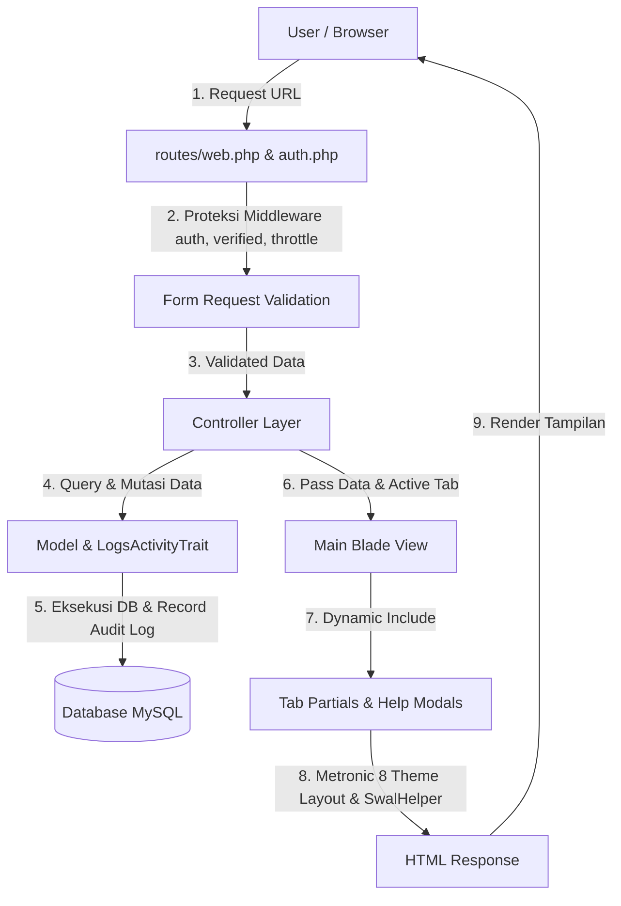

# 🚀 Master WebAdmin - Laravel 12 & Metronic 8.3.2

[](https://github.com/AbdoelMadjid/master-webadmin/tags)
[](https://laravel.com)
[](https://php.net)
[](https://keenthemes.com/metronic)
[](LICENSE)
[](https://github.com/AbdoelMadjid/master-webadmin)

Sistem Dashboard Administrasi Enterprise tingkat tinggi berbasis **Laravel 12.0** dan Template Premium **Metronic 8.3.2**. Dirancang menggunakan metodologi **Structure Mirroring** (keselarasan 4-layer MVC), arsitektur **RBAC Granular**, **Audit Trail Mutasi Data**, **Scheduled Database Backup**, **Proteksi Rate Limiting**, dan **Kunci Layar (Lock Screen)**.

---

<a id="table-of-contents"></a>
## 📋 Table of Contents

- [⚙️ Persyaratan Sistem](#persyaratan-sistem)
- [🚀 Tahapan & Ceklis Pengembangan Project (Development Roadmap)](#development-roadmap)
- [🌟 Fitur Utama Aplikasi](#fitur-utama)
- [🏗️ Arsitektur MVC & Struktur Folder Views](#arsitektur-mvc)
- [🛠️ Panduan Instalasi Cepat](#panduan-instalasi)
- [🔑 Akun Login Bawaan](#akun-login)
- [⏰ Perintah Artisan Khusus & Scheduler](#perintah-artisan)
- [📚 Dokumentasi Skema & Operasional Pemrograman](#dokumentasi-skema)
- [📝 Catatan Rilis & Riwayat Versi (Changelog)](#catatan-rilis)
- [📄 Lisensi](#lisensi)

---

<a id="persyaratan-sistem"></a>
## ⚙️ Persyaratan Sistem

- **PHP**: `>= 8.2` (dengan ekstensi `pdo`, `mbstring`, `openssl`, `xml`, `gd`, `zip`)
- **Composer**: `>= 2.x`
- **Node.js**: `>= 18.x` & **NPM**
- **Database**: MySQL `>= 8.0` / MariaDB `>= 10.4`

<div align="right"><a href="#table-of-contents" title="Kembali ke Table of Contents">⬆ Kembali ke Table of Contents</a></div>

---

<a id="development-roadmap"></a>
## 🚀 Tahapan & Ceklis Pengembangan Project (Development Roadmap)

Berikut adalah rekam jejak pengembangan sistem dari awal hingga tahap **Finalisasi (Production-Ready)**:

- [x] **Fase 1: Inisialisasi Framework & Fondasi Dasar**
  - [x] Instalasi Framework **Laravel 12.0** (PHP ^8.2).
  - [x] Setup environment `.env`, pembentukan app key, dan konfigurasi basis data MySQL.
  - [x] Integrasi otentikasi bawaan **Laravel Breeze** (Sanctum & Session Auth).

- [x] **Fase 2: Integrasi UI Layout Metronic 8 & Asset Pipeline**
  - [x] Integrasi Template **Metronic 8.3.2** (Bootstrap 5, Vanilla JS, Keenicons Duotone).
  - [x] Penerapan Mode Gelap/Terang (*Dark/Light Mode Switcher*) & Aksesibilitas Layout.
  - [x] Penerapan Arsitektur **Structure Mirroring** (Keselarasan 4-Layer: Route &rarr; Controller &rarr; Form Request &rarr; Model &rarr; View).
  - [x] Pembungkusan Komponen Reusable Blade Partials (`_toolbar`, `_header`, `_sidebar`, `_footer`).

- [x] **Fase 3: Manajemen Pengguna & Otorisasi RBAC Granular**
  - [x] Integrasi **Spatie Laravel-Permission 6.x** untuk Peran (*Role*) & Hak Akses (*Permission*).
  - [x] Modul User Management (CRUD, Approval Workflow Pendaftaran, Log Penolakan, Deaktivasi Akun).
  - [x] Fitur **Impersonasi Sesi Aman** (`impersonate` & `leave-impersonate`).
  - [x] Matriks Akses Role & Akses User per modul secara presisi (*Fine-Grained Permissions*).
  - [x] Alur Pengajuan Reset Password terverifikasi Administrator.
  - [x] Fitur **Import & Export Massal** (Excel/CSV via PhpSpreadsheet) & Generator Template Excel.

- [x] **Fase 4: Modul Pendukung Aplikasi (App Support Suite)**
  - [x] **AppFitur (Dynamic Feature Toggle)**: Kontrol aktif/nonaktif modul secara instan dari dashboard.
  - [x] **AppProfil (Identitas Aplikasi)**: Pengaturan Identitas Aplikasi terpusat (Logo, Favicon, Meta Tag, Footnote).
  - [x] **Menu Builder (Manajemen Menu)**: Penataan hirarki menu sidebar/header, urutan (*sorting*), & proteksi permission.
  - [x] **Referensi (Master Lookup Table)**: Sistem data referensi/kategori terpusat.
  - [x] **DataLogin (Session Audit)**: Monitoring sesi login user & geolokasi IP.

- [x] **Fase 5: Peningkatan Keamanan & Keandalan Sistem (System Hardening)**
  - [x] **Automated Scheduled Backup**: Engine backup database SQL, Artisan Command (`php artisan backup:db`), & Laravel Scheduler (Harian pkl 01:00 AM).
  - [x] **Audit Trail Mutation Logging**: Integrasi `spatie/laravel-activitylog` & `LogsActivityTrait` untuk merekam mutasi data model (Create, Update, Delete) beserta inspeksi diff nilai lama vs baru.
  - [x] **Rate Limiting Endpoint Sensitif**: Proteksi middleware `throttle` terukur pada Login, Reset Password, & Backup/Restore Database.
  - [x] **Session Idle Timeout & Manual Lock Screen**: Deteksi inaktivitas otomatis (`_idle-timer.blade.php`) dan fitur Kunci Layar (*Lock Screen*) mandiri pada dropdown avatar akun.

- [x] **Fase 6: Dokumentasi Internal & Usability (Finalisasi)**
  - [x] Dukungan **100% Bilingual (`en`/`id`)** di seluruh navigasi & konten aplikasi.
  - [x] **Modal Petunjuk Operasional** kontekstual (4-Card Box Sectioning) pada setiap halaman modul.
  - [x] Modul Dokumentasi Skema & Operasional Pemrograman internal (`/help/pemrograman/...`).

<div align="right"><a href="#table-of-contents" title="Kembali ke Table of Contents">⬆ Kembali ke Table of Contents</a></div>

---

<a id="fitur-utama"></a>
## 🌟 Fitur Utama Aplikasi

1. **Role-Based Access Control (RBAC)**: Pengaturan peran dan hak akses dinamis dengan visualisasi matriks izin.
2. **Audit Trail & Activity Log**: Perekaman aktivitas mutasi data secara otomatis dengan penilik selisih nilai atribut (*Inspector Diff Modal*).
3. **Automated Scheduled Backup**: Fitur unduh, buat, dan pulihkan cadangan database SQL otomatis via scheduler.
4. **Rate Limiting Protection**: Mencegah serangan brute-force dan eksploitasi memori pada endpoint sensitif.
5. **Session Timeout & Lock Screen**: Penguncian layar otomatis saat inaktif dan pintasan Kunci Layar mandiri pada avatar pengguna.
6. **100% Bilingual Support**: Pengalihan bahasa instan (Inggris & Indonesia) tanpa teks tercampur.
7. **Petunjuk Operasional Modal**: Panduan penggunaan terintegrasi di setiap halaman modul aplikasi.

<div align="right"><a href="#table-of-contents" title="Kembali ke Table of Contents">⬆ Kembali ke Table of Contents</a></div>

---

<a id="arsitektur-mvc"></a>
## 🏗️ Arsitektur MVC & Struktur Folder Views

Aplikasi ini mengadopsi metodologi **Structure Mirroring** untuk menjamin keselarasan folder 100% antara Controller, Form Request, Model, dan Blade View.

### 1. Diagram Alur Request MVC (Mermaid Architecture Flow)


```mermaid
graph TD
    A["User / Browser"] -->|1. Request URL| B["routes/web.php & auth.php"]
    B -->|2. Proteksi Middleware auth, verified, throttle| C["Form Request Validation"]
    C -->|3. Validated Data| D["Controller Layer"]
    D -->|4. Query & Mutasi Data| E["Model & LogsActivityTrait"]
    E -->|5. Eksekusi DB & Record Audit Log| F[("Database MySQL")]
    D -->|6. Pass Data & Active Tab| G["Main Blade View"]
    G -->|7. Dynamic Include| H["Tab Partials & Help Modals"]
    H -->|8. Metronic 8 Theme Layout & SwalHelper| I["HTML Response"]
    I -->|9. Render Tampilan| A
```

#### Penjelasan Alur Request Sistem:
1. **User / Browser**: Pengguna melakukan interaksi atau navigasi ke URL tertentu (misal: `/appsupport/data-login?tab=activity-log`).
2. **Routes & Middleware**: Permintaan ditangkap oleh `routes/web.php` atau `routes/auth.php` dan dikawal oleh middleware keamanan (`auth`, `verified`, dan **`throttle` rate limiting**).
3. **Form Request Validation**: Input pengguna disaring dan divalidasi secara khusus melalui kelas `App\Http\Requests\<SubFolder>\<Feature>Request.php` untuk mencegah Mass Assignment & kerentanan XSS/SQLi.
4. **Controller Layer**: Kelas `App\Http\Controllers\<SubFolder>\<Feature>Controller.php` menerima data ter-sanitize dan memproses logika bisnis.
5. **Model & LogsActivityTrait**: Model Eloquent (`App\Models\...`) memproses query ke database. Jika terjadi mutasi data (Create, Update, Delete), trait `LogsActivityTrait` secara otomatis merekam log aktivitas ke tabel `activity_log` lengkap dengan selisih atribut (diff), IP address, dan User-Agent client.
6. **Database MySQL**: Eksekusi perintah SQL dilakukan di basis data MySQL/MariaDB secara aman.
7. **Main Blade View**: Controller meneruskan data dan indikator sub-tab aktif (`$activeTab`) ke tampilan utama `resources/views/pages/<subfolder>/<feature>.blade.php`.
8. **Tab Partials & Help Modals**: Tampilan utama secara dinamis meng-include sub-tab partial (`resources/views/pages/<subfolder>/tabs/<feature>/_<tab>.blade.php`) dan modal petunjuk operasional (`partials/<feature>-help-modal.blade.php`).
9. **Metronic 8 Layout & HTML Response**: Hasil akhir dirakit menggunakan tema Metronic 8, komponen duotone Keenicons, dan JS helper (`SwalHelper`), lalu dikembalikan dalam bentuk HTML response yang fluid dan responsif ke browser pengguna.

### 2. Metodologi Structure Mirroring (Alur 4-Layer MVC)
Setiap fitur aplikasi dibangun dengan struktur 4-layer yang saling bercermin:
```text
[Route] /appsupport/app-fitur
   │
   ├── [Controller]   App\Http\Controllers\AppSupport\AppFiturController.php
   ├── [Form Request] App\Http\Requests\AppSupport\AppProfilRequest.php
   ├── [Model]        App\Models\AppSupport\AppFitur.php
   └── [Blade View]   resources/views/pages/appsupport/app-fitur.blade.php
```

### 3. Hierarki Folder Views (`resources/views/`)

```text
resources/views/
├── auth/                  # Halaman autentikasi (login, register, reset password, verify email)
├── components/            # Komponen Blade reusable (alert, modal, badge, button)
├── layouts/               # Layout utama aplikasi (index.blade.php, _default.blade.php)
│   ├── header/            # Struktur partial header layout
│   └── partials/          # Partial layout utama (sidebar, header, footer, toolbar, _idle-timer, docs)
├── pages/                 # Seluruh halaman modul fitur utama (Structure Mirroring)
│   ├── apps/              # Halaman modul aplikasi (chat, e-commerce, dsb)
│   ├── appsupport/        # Modul App Support (AppProfil, AppFitur, Menu Builder, Referensi, BackupDB, DataLogin & Audit Trail)
│   │   ├── partials/      # Modal form CRUD & modal petunjuk operasional (<feature>-help-modal.blade.php)
│   │   └── tabs/          # Sub-tab view partials (_login_log.blade.php, _activity_log.blade.php)
│   ├── dashboards/        # Halaman dashboard utama aplikasi
│   ├── docs/              # Halaman dokumentasi UI Metronic
│   ├── help/              # Help & Bantuan Internal Pemrograman (/help/pemrograman/...)
│   ├── layouts/           # Varian layout page-level
│   ├── manajemenpengguna/ # Modul RBAC (Role, Permission, Akses Role, Akses User, User, Reset Password)
│   └── pages/             # Group halaman umum / demo Metronic pages
├── partials/              # Widget/partial global reusable lintas halaman (modals, search, theme-mode)
└── profile/               # Halaman profil pengguna (edit avatar, ganti password, deactivate account)
```

#### Penjelasan Hirarki Folder Views:
- **`auth/`**: Mengelola halaman gerbang masuk sistem seperti login (`login.blade.php`), registrasi (`register.blade.php`), dan pengajuan reset password.
- **`layouts/` & `layouts/partials/`**: Berisi kerangka dasar aplikasi Metronic 8. Terdiri dari komponen partial terpisah seperti `_header.blade.php`, `_sidebar.blade.php`, `_footer.blade.php`, dan `_idle-timer.blade.php` (Session Inactivity Timer).
- **`pages/` (Feature Folder)**: Merupakan folder utama seluruh fitur bisnis yang mengikuti metodologi **Structure Mirroring** (cermin 1:1 dari rute URL).
  - **`pages/manajemenpengguna/`**: Mengelola modul otorisasi RBAC (Role, Permission, Matriks Akses Role & User, User Approval, & Reset Password Claim).
  - **`pages/appsupport/`**: Mengelola modul pendukung sistem (AppProfil, AppFitur Toggle, Dynamic Menu Builder, Data Referensi Master, Backup Database SQL Engine, serta **DataLogin & Multi-Tab Audit Trail Activity Log**).
  - **`pages/help/`**: Pusat dokumentasi pemrograman internal terintegrasi (`/help/pemrograman/...`) mencakup skema arsitektur dan panduan operasional.
  - **Sub-folder `tabs/<feature>/`**: Menyimpan berkas sub-tab partial (diawali `_`) untuk halaman berbasis Multi-Tab Single Route (misal: `_activity_log.blade.php`).
  - **Sub-folder `partials/`**: Menyimpan modal form CRUD dan **Modal Petunjuk Operasional** kontekstual (`<feature>-help-modal.blade.php`).
- **`partials/`**: Menyimpan widget global lintas modul seperti modal pencarian global, switcher tema mode gelap/terang, dan elemen umum.
- **`profile/`**: Mengelola tampilan mandiri profil pengguna (Self-Service User Profile).

<div align="right"><a href="#table-of-contents" title="Kembali ke Table of Contents">⬆ Kembali ke Table of Contents</a></div>

---

<a id="panduan-instalasi"></a>
## 🛠️ Panduan Instalasi Cepat

### 1. Clone Repositori
```bash
git clone https://github.com/AbdoelMadjid/master-webadmin.git
cd master-webadmin
```

### 2. Instal Dependencies
```bash
composer install
npm install
```

### 3. Konfigurasi Environment & Key
```bash
cp .env.example .env
php artisan key:generate
```

### 4. Konfigurasi Database & Migrasi Data Initial
Edit file `.env` sesuaikan koneksi database Anda, lalu jalankan migrasi beserta seeder:
```bash
php artisan migrate --seed
```

### 5. Jalankan Server Lokal
```bash
# Menjalankan server aplikasi dan Vite sekaligus:
npm run dev
# Atau jalankan via PHP CLI:
php artisan serve
```

<div align="right"><a href="#table-of-contents" title="Kembali ke Table of Contents">⬆ Kembali ke Table of Contents</a></div>

---

<a id="akun-login"></a>
## 🔑 Akun Login Bawaan

| Peran (Role) | Email Login | Password | Akses Utama |
| :--- | :--- | :--- | :--- |
| **Super Admin / Master** | `master@admin.com` | `password` | Akses Penuh Seluruh Modul & Sistem |
| **Admin** | `admin@admin.com` | `password` | Akses Modul Manajerial & Fitur Utama |
| **User** | `user@admin.com` | `password` | Akses Modul Pengguna Biasa & Profil |

<div align="right"><a href="#table-of-contents" title="Kembali ke Table of Contents">⬆ Kembali ke Table of Contents</a></div>

---

<a id="perintah-artisan"></a>
## ⏰ Perintah Artisan Khusus & Scheduler

### Perintah Backup Database Manual:
```bash
php artisan backup:db {--name=nama_backup} {--type=full}
```

### Menjalankan Laravel Scheduler (Cron Job):
```bash
php artisan schedule:run
```
*Atau tambahkan Cron Entry di server production:*
```cron
* * * * * cd /path-to-your-project && php artisan schedule:run >> /dev/null 2>&1
```

<div align="right"><a href="#table-of-contents" title="Kembali ke Table of Contents">⬆ Kembali ke Table of Contents</a></div>

---

<a id="dokumentasi-skema"></a>
## 📚 Dokumentasi Skema & Operasional Pemrograman Internal

Untuk melihat panduan arsitektur lengkap, skema pemrograman, dan alur operasional internal bagi tim developer, silakan buka berkas dokumentasi internal di:

👉 [**Dokumentasi Skema & Operasional Pemrograman (docs/skema-pemrograman/README.md)**](./docs/skema-pemrograman/README.md)

<div align="right"><a href="#table-of-contents" title="Kembali ke Table of Contents">⬆ Kembali ke Table of Contents</a></div>

---

<a id="catatan-rilis"></a>
## 📝 Catatan Rilis & Riwayat Versi (Changelog)

### 📌 Versi v1.0.1 (2026-07-27) - *Enhancement & Security Patch*
- **[Fitur Baru] Interactive Lock Screen Overlay**:
  - Penambahan tombol **Kunci Layar (Lock Screen)** pada dropdown avatar akun pengguna (`_user-account-menu.blade.php`).
  - Overlay Modal Fullscreen beraksen *Glassmorphic Blur* (`_lock-screen-modal.blade.php`).
  - Verifikasi password terproteksi via AJAX request (`POST /lock-screen/unlock`) dengan indikator *loading spinner* Metronic 8 yang presisi.
  - Integrasi otomatis dengan `_idle-timer.blade.php` (penguncian layar otomatis setelah 15 menit inaktivitas).
- **[Dokumentasi] Pembaruan README & Navigasi**:
  - Penambahan diagram alur request MVC berbasis **Mermaid (`mermaid`)** beserta penjelasan 9-step alur request sistem.
  - Penambahan struktur pohon ASCII **Hierarki Folder Views (`resources/views/`)** beserta rincian fungsinya.
  - Perbaikan navigasi jangkar eksplisit `<a id="..."></a>` pada Table of Contents.
  - Penambahan tombol **`⬆ Kembali ke Table of Contents`** di setiap akhir seksi.

---

### 📌 Versi v1.0.0 (2026-07-27) - *Initial Official Production Release*
- **[Arsitektur Inti] Structure Mirroring (4-Layer MVC)**:
  - Keselarasan 1:1 antara Route, Controller (`App\Http\Controllers`), Form Request (`App\Http\Requests`), Model (`App\Models`), dan View (`resources/views/pages`).
- **[Otentikasi & RBAC Granular]**:
  - Integrasi **Spatie Laravel-Permission 6.x** untuk pengelolaan Role & Permission.
  - Matriks Hak Akses Granular (Peran vs User Direct Access).
  - Modul User Management (CRUD, Approval Workflow Pendaftaran, Log Penolakan, Deaktivasi Akun).
  - Fitur **Impersonasi Sesi Aman** (`impersonate` & `leave-impersonate`).
  - Fitur Import/Export Massal Excel via PhpSpreadsheet.
- **[App Support Suite]**:
  - **AppFitur**: Dynamic Feature Toggle untuk kontrol aktif/nonaktif modul secara instant.
  - **AppProfil**: Pengaturan identitas aplikasi terpusat (Logo, Favicon, Copyright).
  - **Menu Builder**: Manajemen hirarki menu sidebar & header.
  - **Data Referensi**: Master lookup table acuan pilihan dropdown form.
  - **DataLogin**: Audit log sesi login user & geolokasi IP.
- **[Keamanan & Keandalan Sistem]**:
  - **Automated Scheduled Backup**: Engine backup SQL (`php artisan backup:db`) & Laravel Scheduler (Harian 01:00 AM).
  - **Audit Trail Mutation Logging**: Integrasi `spatie/laravel-activitylog` & `LogsActivityTrait` untuk perekaman otomatis perubahan data model (Create, Update, Delete) beserta inspeksi diff.
  - **Rate Limiting**: Proteksi middleware `throttle` pada endpoint sensitif (login, reset password, backup, & restore).
  - **Session Idle Timeout**: Deteksi inaktivitas otomatis.
- **[Usability & DX]**:
  - Dukungan **100% Bilingual (`en`/`id`)** tanpa teks bercampur.
  - **Modal Petunjuk Operasional** kontekstual di setiap modul aplikasi.
  - Modul dokumentasi pemrograman internal terintegrasi (`/help/pemrograman/...`).

<div align="right"><a href="#table-of-contents" title="Kembali ke Table of Contents">⬆ Kembali ke Table of Contents</a></div>

---

<a id="lisensi"></a>
## 📄 Lisensi

Proyek ini dilindungi di bawah lisensi [MIT License](LICENSE).

<div align="right"><a href="#table-of-contents" title="Kembali ke Table of Contents">⬆ Kembali ke Table of Contents</a></div>
