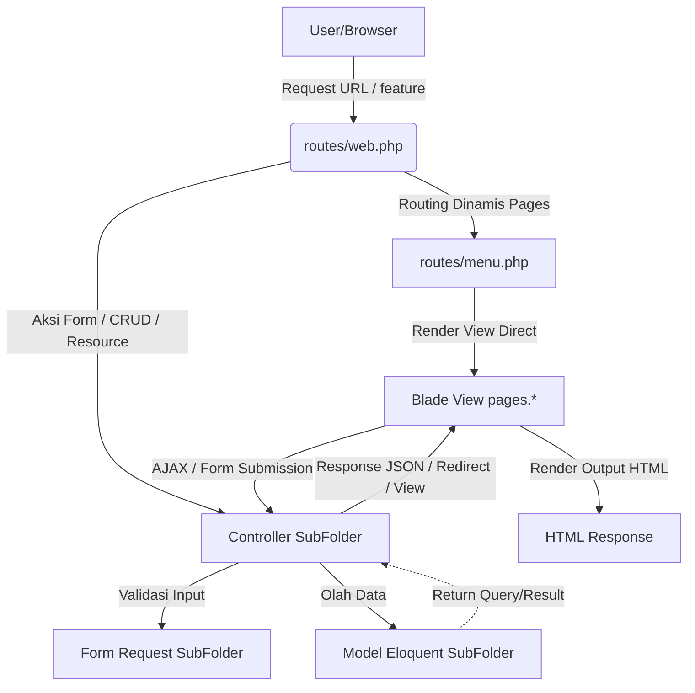

# Master Web Admin dengan Metronic 8.3.2 - Laravel 12

Project ini adalah implementasi Web Admin pada Laravel 12 dengan Template Metronic.

Repository:
`https://github.com/AbdoelMadjid/master-webadmin.git`

## Table of Contents

- [Requirement](#requirement)
- [1. Clone Project](#1-clone-project)
- [2. Install Dependency](#2-install-dependency)
- [3. Setup Environment](#3-setup-environment)
- [4. Konfigurasi Database](#4-konfigurasi-database)
- [5. Menjalankan Aplikasi](#5-menjalankan-aplikasi)
- [Opsi Setup Cepat](#opsi-setup-cepat)
- [Mode Development Sekali Jalan](#mode-development-sekali-jalan)
- [Testing](#testing)
- [Troubleshooting](#troubleshooting)
- [Akun Login Development](#akun-login-development)
- [Environment Variables Penting](#environment-variables-penting)
- [Deployment (Production) Singkat](#deployment-production-singkat)
- [Queue & Scheduler](#queue--scheduler)
- [Struktur Folder Views](#struktur-folder-views)
- [Alur MVC (Model-View-Controller)](#alur-mvc-model-view-controller)
- [Alur Route, URL Dinamis, dan Config Menu](#alur-route-url-dinamis-dan-config-menu)
- [Tutorial Singkat Skema Pemrograman](#tutorial-singkat-skema-pemrograman)
- [Akses dari aplikasi](#akses-dari-aplikasi)
- [Materi inti (sesuai menu sidebar)](#materi-inti-sesuai-menu-sidebar)
- [Materi operasional](#materi-operasional)
- [Referensi file konfigurasi menu](#referensi-file-konfigurasi-menu)
- [Validasi cepat route help](#validasi-cepat-route-help)

## Requirement

- PHP `>= 8.2`
- Composer `>= 2.x`
- Node.js `>= 18` (disarankan LTS terbaru)
- NPM
- MySQL/MariaDB

<div align="right"><a href="#table-of-contents" title="Back to Table of Contents">&#8679;</a></div>

## 1. Clone Project

```bash
git clone https://github.com/AbdoelMadjid/master-webadmin.git
cd master-webadmin
```

<div align="right"><a href="#table-of-contents" title="Back to Table of Contents">&#8679;</a></div>

## 2. Install Dependency

```bash
composer install
npm install
```

<div align="right"><a href="#table-of-contents" title="Back to Table of Contents">&#8679;</a></div>

## 3. Setup Environment

Salin file environment:

```bash
cp .env.example .env
```

Jika di Windows PowerShell:

```powershell
Copy-Item .env.example .env
```

Generate app key:

```bash
php artisan key:generate
```

<div align="right"><a href="#table-of-contents" title="Back to Table of Contents">&#8679;</a></div>

## 4. Konfigurasi Database

Edit `.env` bagian database:

```env
DB_CONNECTION=mysql
DB_HOST=127.0.0.1
DB_PORT=3306
DB_DATABASE=nama_database_anda
DB_USERNAME=root
DB_PASSWORD=
```

Lalu jalankan migrasi:

```bash
php artisan migrate
```

<div align="right"><a href="#table-of-contents" title="Back to Table of Contents">&#8679;</a></div>

## 5. Menjalankan Aplikasi

Jalankan backend Laravel:

```bash
php artisan serve
```

Jalankan Vite (asset frontend) di terminal lain:

```bash
npm run dev
```

Buka aplikasi:
`http://127.0.0.1:8000`

<div align="right"><a href="#table-of-contents" title="Back to Table of Contents">&#8679;</a></div>

## Opsi Setup Cepat

Project ini sudah punya script Composer `setup`:

```bash
composer run setup
```

Script ini akan:

- install dependency PHP
- membuat `.env` jika belum ada
- generate app key
- migrate database
- install dependency Node
- build assets production

<div align="right"><a href="#table-of-contents" title="Back to Table of Contents">&#8679;</a></div>

## Mode Development Sekali Jalan

Tersedia juga script:

```bash
composer run dev
```

Script ini menjalankan:

- `php artisan serve`
- queue listener
- laravel pail (log)
- `npm run dev`

<div align="right"><a href="#table-of-contents" title="Back to Table of Contents">&#8679;</a></div>

## Testing

```bash
php artisan test
```

<div align="right"><a href="#table-of-contents" title="Back to Table of Contents">&#8679;</a></div>

## Troubleshooting

- Jika style/js tidak update:
    - jalankan `php artisan optimize:clear`
    - restart `npm run dev`
- Jika error cache config/route/view:
    - `php artisan optimize:clear`
- Jika migrasi gagal:
    - cek kredensial DB di `.env`
    - pastikan database sudah dibuat

<div align="right"><a href="#table-of-contents" title="Back to Table of Contents">&#8679;</a></div>

## Akun Login Development

Data akun default berdasarkan seeder project saat ini (`database/seeders/UserSeeder.php` via `DatabaseSeeder.php`):

URL Login: `http://127.0.0.1:8000/login`

| Role | Nama | Email | Password |
| :--- | :--- | :--- | :--- |
| **Master** | master | `master@gmail.com` | `password` |
| **Admin** | admin | `admin@gmail.com` | `password` |
| **User** | user | `user@gmail.com` | `password` |

Cara membuat akun ini:

```bash
php artisan migrate:fresh --seed
```

Catatan:

- Masing-masing akun otomatis ditugaskan Role Spatie (`master`, `admin`, `user`).
- Password default untuk seluruh akun seeder adalah `password`.
- Jika database sudah berisi data lama, gunakan `migrate:fresh --seed` hanya di environment local/dev.

<div align="right"><a href="#table-of-contents" title="Back to Table of Contents">&#8679;</a></div>

## Environment Variables Penting

Variabel minimum yang biasanya perlu disesuaikan:

```env
APP_NAME=Laravel
APP_ENV=local
APP_DEBUG=true
APP_URL=http://localhost

DB_CONNECTION=mysql
DB_HOST=127.0.0.1
DB_PORT=3306
DB_DATABASE=master-webadmin
DB_USERNAME=root
DB_PASSWORD=

QUEUE_CONNECTION=database
CACHE_STORE=database
SESSION_DRIVER=database

MAIL_MAILER=log
MAIL_HOST=127.0.0.1
MAIL_PORT=2525
MAIL_USERNAME=null
MAIL_PASSWORD=null
MAIL_FROM_ADDRESS="hello@example.com"
MAIL_FROM_NAME="${APP_NAME}"
```

Catatan:

- Nilai di atas mengikuti `.env.example` project ini.
- Untuk production, sesuaikan `APP_URL`, kredensial DB, dan SMTP asli server.

<div align="right"><a href="#table-of-contents" title="Back to Table of Contents">&#8679;</a></div>

## Deployment (Production) Singkat

Contoh alur deploy minimal di server production:

Command deploy final yang direkomendasikan untuk project ini:

```bash
git pull origin main
composer install --no-dev --optimize-autoloader
npm ci
npm run build
php artisan migrate --force
php artisan optimize:clear
php artisan optimize
```

Setup awal server (sekali saat provisioning):

```bash
cp .env.example .env
php artisan key:generate
php artisan storage:link
```

Checklist production:

- `APP_ENV=production`
- `APP_DEBUG=false`
- set permission folder `storage/` dan `bootstrap/cache/`
- konfigurasi web server (Nginx/Apache) mengarah ke folder `public/`

<div align="right"><a href="#table-of-contents" title="Back to Table of Contents">&#8679;</a></div>

## Queue & Scheduler

Konfigurasi real saat ini:

- Queue connection default: `database` (`.env.example` dan `config/queue.php`).
- Driver session/cache: `database`.
- Scheduler: belum ada task terdaftar (belum ada definisi schedule di project).

Command worker queue yang dipakai saat development (sesuai `composer run dev`):

```bash
php artisan queue:listen --tries=1 --timeout=0
```

Command worker queue untuk production (direkomendasikan):

```bash
php artisan queue:work --tries=3
```

Scheduler (opsional, jika nanti ada task) bisa disiapkan dari sekarang via cron:

```cron
* * * * * cd /path/to/project && php artisan schedule:run >> /dev/null 2>&1
```

Opsional dengan Supervisor (direkomendasikan production):

- Buat konfigurasi process `queue:work`
- Set `autostart=true` dan `autorestart=true`

<div align="right"><a href="#table-of-contents" title="Back to Table of Contents">&#8679;</a></div>

## Struktur Folder Views

Struktur utama folder Blade pada project ini:

```text
resources/views/
├── auth/                  # Halaman autentikasi (login, register, reset password, dst)
├── components/            # Komponen Blade reusable
├── layouts/               # Layout utama aplikasi
│   ├── header/            # Struktur header layout
│   └── partials/          # Partial layout (sidebar, footer, toolbar, docs, dll)
├── pages/                 # Seluruh halaman fitur utama
│   ├── apps/              # Halaman aplikasi (chat, e-commerce, dsb)
│   ├── appsupport/        # Modul App Support (Form partials & subfolder tabs/)
│   ├── dashboards/        # Halaman dashboard
│   ├── demo/              # Halaman demo Metronic
│   ├── docs/              # Halaman dokumentasi
│   ├── help/              # Help internal (termasuk Skema Pemrograman & tabs/)
│   ├── profil/            # Form partials & sub-tab partials profil user
│   │   ├── partials/      # Modal forms & layout header details
│   │   └── tabs/          # Penampung partial sub-tab profil (_*.blade.php)
│   └── profil-pengguna.blade.php # View utama fitur profil (?tab=...)
├── partials/              # Widget/partial global reusable lintas halaman
└── profile/               # Halaman profil user
```

### Konvensi Partials & Arsitektur Multi-Tab

1. **Struktur Route ke View Utama**:
   - Setiap route Blade dipetakan langsung ke file view utama di `resources/views/pages/{subfolder}/{feature}.blade.php`.

2. **Form & Component Partials (`partials/`)**:
   - Form HTML (seperti modal CRUD) atau bagian layout khusus dipisahkan ke dalam subfolder `partials/` (contoh: `resources/views/pages/{subfolder}/partials/{feature}-form.blade.php`).
   - Di-`@include` secara eksplisit di dalam view utama.

3. **Arsitektur Sub-Tab Multi-Tab (`tabs/{feature}/`)**:
   - Untuk fitur yang memiliki sub-tab berbasis single route dengan query parameter (`/{subfolder}/{feature}?tab=...`), seluruh file partial sub-tab **wajib** disimpan dalam direktori khusus `tabs/{feature}/`.
   - File partial sub-tab menggunakan awalan *underscore* `_` (contoh: `resources/views/pages/{subfolder}/tabs/{feature}/_{tab}.blade.php`).
   - Di-`@include` secara dinamis pada view utama menggunakan pola:
     ```php
     @include('pages.{subfolder}.tabs.{feature}._' . str_replace('-', '_', $activeTab))
     ```
   - **Aturan Partial Tab**: File partial sub-tab **tidak boleh** mengandung `@extends`, `@section`, atau tag penutup `</div>` container parent agar tidak merusak layout global dan posisi footer.

<div align="right"><a href="#table-of-contents" title="Back to Table of Contents">&#8679;</a></div>

<a id="readme-mvc"></a>

## Alur MVC (Model-View-Controller)

Project ini menggabungkan **Routing Dinamis Metronic berbasis View** untuk navigasi halaman dan **Pola Mirroring MVC + Form Request** untuk pengolahan data dan fitur CRUD. Alurnya sebagai berikut:


```mermaid
graph TD
    A[User/Browser] -->|Request URL / feature| B(routes/web.php)
    B -->|Routing Dinamis Pages| C[routes/menu.php]
    C -->|Render View Direct| D[Blade View pages.*]
    
    B -->|Aksi Form / CRUD / Resource| E[Controller SubFolder]
    E -->|Validasi Input| F[Form Request SubFolder]
    E -->|Olah Data| G[Model Eloquent SubFolder]
    G -.->|Return Query/Result| E
    E -->|Response JSON / Redirect / View| D
    
    D -->|AJAX / Form Submission| E
    D -->|Render Output HTML| H[HTML Response]
```

### Penjelasan Utama MVC & Konvensi Architecture:

1. **Routing Utama (`routes/web.php`) & Routing Dinamis (`routes/menu.php`)**:
   - `routes/web.php` me-load `routes/menu.php` untuk scan otomatis seluruh Blade view di `resources/views/pages/**/*.blade.php`.
   - URL path (`/`) dan route name (`.`) terbentuk secara otomatis dari struktur file view.
   - Endpoint aksi CRUD (POST/PUT/DELETE) didefinisikan secara eksplisit di `routes/web.php` mengarah ke Controller terkait.

2. **Konvensi Mirroring Subfolder (Controller, Model, Form Request)**:
   - Struktur Controller, Model, dan Form Request **wajib mencerminkan (mirror)** hirarki folder Blade View di bawah `resources/views/pages/`.
   - **Contoh Mapping Fitur**:
     - View: `resources/views/pages/appsupport/app-profil.blade.php`
     - Controller: `App\Http\Controllers\AppSupport\AppProfilController`
     - Model: `App\Models\AppSupport\AppProfil`
     - Form Request: `App\Http\Requests\AppSupport\AppProfilRequest`

3. **Layer Validasi via Form Request**:
   - Seluruh aturan validasi dikumpulkan dalam kelas Form Request di `App\Http\Requests\<SubFolder>\<FeatureRequest>.php`, bukan ditulis inline di dalam Controller.
   - Respon validasi 422 XHR ditangani secara otomatis oleh frontend menggunakan helper JavaScript global `SwalHelper.validationError(xhr)`.

4. **Multi-Tab Sub-View pada Single Route**:
   - Halaman fitur yang memiliki banyak sub-tab menggunakan query parameter (contoh: `/profil-pengguna?tab=...` atau `/appsupport?tab=...`).
   - Pendekatan ini menjaga highlight aktif menu sidebar tetap utuh pada route utama sambil me-`@include` partial tab dari subfolder `tabs/<feature>/`.

5. **Middleware & Otentikasi**:
   - Seluruh route halaman `pages.*` dibungkus oleh middleware `auth` dan terintegrasi dengan Spatie Permission (`assignRole`, `hasPermissionTo`) serta helper global fitur (`isFeatureActive()`).

### Cross-reference ke Panduan_MVC.md

<a id="readme-mvc-routing"></a>
**Routing**
- Ringkasan ada di section ini.
- Detail teknis ada di: [Panduan MVC - Routing (Entry Point)](./Panduan_MVC.md#mvc-routing)

<a id="readme-mvc-controller"></a>
**Controller & Form Request**
- Ringkasan ada di section ini.
- Detail teknis ada di: [Panduan MVC - Controller](./Panduan_MVC.md#mvc-controller)

<a id="readme-mvc-crud"></a>
**CRUD & Mirroring Structure**
- Ringkasan: Pengolahan CRUD menggunakan controller, model, dan form request berbasis konvensi subfolder ter-mirror.
- Detail teknis ada di: [Panduan MVC - Menambah Fitur CRUD](./Panduan_MVC.md#mvc-crud)

Dokumen lengkap: [Panduan MVC Lengkap](./Panduan_MVC.md)

<div align="right"><a href="#table-of-contents" title="Back to Table of Contents">&#8679;</a></div>

## Alur Route, URL Dinamis, dan Config Menu

Ringkasan alur yang dipakai di project ini:

1. File Blade di `resources/views/pages/**` dibaca otomatis oleh `routes/menu.php`.
2. Path file dikonversi menjadi:
    - route name: format titik (`.`)
    - URL: format slash (`/`)
3. Config menu (`config/sidebar/*.php`, `config/header/*.php`) memanggil route tersebut lewat key `route`.
4. Renderer menu Blade (`layouts/partials/sidebar/_menu-item.blade.php`) menampilkan menu berdasarkan `route` atau `href`.

Contoh mapping otomatis (dari `routes/menu.php`):

```text
resources/views/pages/help/pemrograman/skema/route.blade.php
=> route name: help.pemrograman.skema.route
=> URL: /help/pemrograman/skema/route
=> view: pages.help.pemrograman.skema.route
```

Pola definisi menu di config:

```php
[
    'title' => 'Skema Route',
    'route' => 'help.pemrograman.skema.route', // route internal aplikasi
]

[
    'title' => 'Documentation',
    'href' => 'https://preview.keenthemes.com/html/metronic/docs', // link eksternal
]
```

Rule praktis:

- Gunakan `route` jika menu menuju halaman internal Laravel (lebih aman saat URL berubah).
- Gunakan `href` jika menu menuju URL absolut/eksternal.
- Pastikan route name di config sama dengan hasil generate route dinamis.

Referensi file:

- `routes/menu.php`
- `config/sidebar/_sidebar_helps.php`
- `config/header/_header_help.php`
- `resources/views/layouts/partials/sidebar/_menu-item.blade.php`

<div align="right"><a href="#table-of-contents" title="Back to Table of Contents">&#8679;</a></div>

## Tutorial Singkat Skema Pemrograman

Menu **Skema Pemrograman** tersedia di sidebar Help dan berisi panduan arsitektur serta panduan operasional project ini.

Dokumentasi versi Markdown (ringkas per submenu) tersedia di:

- [`docs/skema-pemrograman/README.md`](./docs/skema-pemrograman/README.md)
- Kelompok skema: [`docs/skema-pemrograman/skema/`](./docs/skema-pemrograman/skema/)
- Kelompok operasional: [`docs/skema-pemrograman/operasional/`](./docs/skema-pemrograman/operasional/)

Seluruh daftar di bawah diselaraskan dengan route help aplikasi:

- `resources/views/pages/help/pemrograman/overview.blade.php`
- `resources/views/pages/help/pemrograman/skema/*`
- `resources/views/pages/help/pemrograman/operasional/*`

<div align="right"><a href="#table-of-contents" title="Back to Table of Contents">&#8679;</a></div>

### Akses dari Aplikasi

1. Buka aplikasi lalu login (`http://127.0.0.1:8000/login`).
2. Masuk ke menu sidebar: `Help -> Skema Pemrograman`.
3. Halaman overview portal: `/help/pemrograman/overview`.

<div align="right"><a href="#table-of-contents" title="Back to Table of Contents">&#8679;</a></div>

### Kategori 0: Portal Overview

<table>
  <thead>
    <tr>
      <th width="30%">Judul Menu</th>
      <th width="38%">Rincian Isi & Cakupan Materi</th>
      <th width="17%">URL</th>
      <th width="15%">Dokumen</th>
    </tr>
  </thead>
  <tbody>
    <tr>
      <td><strong>Overview</strong></td>
      <td>Dashboard utama Skema Pemrograman yang memetakan seluruh modul arsitektur dan operasional ke dalam kartu navigasi visual berkategori.</td>
      <td><code>/help/pemrograman/overview</code></td>
      <td><a href="./docs/skema-pemrograman/README.md">README.md</a></td>
    </tr>
  </tbody>
</table>

<div align="right"><a href="#table-of-contents" title="Back to Table of Contents">&#8679;</a></div>

### Kategori 1: Materi Inti (Skema Arsitektur)

<table>
  <thead>
    <tr>
      <th width="30%">Judul Menu</th>
      <th width="38%">Rincian Isi & Cakupan Materi</th>
      <th width="17%">URL</th>
      <th width="15%">Dokumen</th>
    </tr>
  </thead>
  <tbody>
    <tr><td><strong>Skema Route</strong></td><td>Generasi route otomatis dari Blade file di <code>pages/</code>, konversi URL slash ke route name dot, dan pendaftaran route di config.</td><td><code>/help/pemrograman/skema/route</code></td><td><a href="./docs/skema-pemrograman/skema/route.md">route.md</a></td></tr>
    <tr><td><strong>Skema Layout</strong></td><td>Struktur shell layout utama Metronic, slot header, toolbar, sidebar, footer, dan wrapper container responsive fluid.</td><td><code>/help/pemrograman/skema/layout</code></td><td><a href="./docs/skema-pemrograman/skema/layout.md">layout.md</a></td></tr>
    <tr><td><strong>Skema Komponen Blade & Partial</strong></td><td>Penggunaan komponen Blade reusable (<code>&lt;x-...&gt;</code>), form partials (<code>partials/</code>), dan tab partials (<code>tabs/</code>).</td><td><code>/help/pemrograman/skema/komponen-blade-partial</code></td><td><a href="./docs/skema-pemrograman/skema/komponen-blade-partial.md">komponen-blade-partial.md</a></td></tr>
    <tr><td><strong>Skema Theme Assets</strong></td><td>Manajemen aset statis Metronic 8, integrasi Vite (<code>@vite</code>), asset resolver helper <code>asset()</code>, dan vendor bundle.</td><td><code>/help/pemrograman/skema/theme-assets</code></td><td><a href="./docs/skema-pemrograman/skema/theme-assets.md">theme-assets.md</a></td></tr>
    <tr><td><strong>Skema Auth dan Middleware</strong></td><td>Alur otentikasi login/logout, proteksi middleware <code>auth</code> pada route dinamis <code>menu.php</code>, dan otorisasi Spatie Permission.</td><td><code>/help/pemrograman/skema/auth-dan-middleware</code></td><td><a href="./docs/skema-pemrograman/skema/auth-dan-middleware.md">auth-dan-middleware.md</a></td></tr>
    <tr><td><strong>Skema Struktur Config Menu</strong></td><td>Format array konfigurasi menu sidebar/header, mapping key <code>title</code>, <code>icon</code>, <code>route</code>, <code>href</code>, <code>children</code>, <code>badge</code>, dan <code>permission</code>.</td><td><code>/help/pemrograman/skema/struktur-config-menu</code></td><td><a href="./docs/skema-pemrograman/skema/struktur-config-menu.md">struktur-config-menu.md</a></td></tr>
    <tr><td><strong>Skema Sidebar Menu</strong></td><td>Mekanisme rendering hirarki menu sidebar, logika active state (<code>request()-&gt;routeIs()</code>), dan collapsible menu.</td><td><code>/help/pemrograman/skema/sidebar-menu</code></td><td><a href="./docs/skema-pemrograman/skema/sidebar-menu.md">sidebar-menu.md</a></td></tr>
    <tr><td><strong>Skema Header Menu</strong></td><td>Rendering menu topbar, megamenu dropdown, active state indicator, serta switch locale & theme mode.</td><td><code>/help/pemrograman/skema/header-menu</code></td><td><a href="./docs/skema-pemrograman/skema/header-menu.md">header-menu.md</a></td></tr>
    <tr><td><strong>Skema Data Layer</strong></td><td>Konvensi Structure Mirroring: Controller, Model, Migration, Seeder, dan Form Request Validation di subfolder ter-mirror.</td><td><code>/help/pemrograman/skema/data-layer</code></td><td><a href="./docs/skema-pemrograman/skema/data-layer.md">data-layer.md</a></td></tr>
    <tr><td><strong>Skema Error Handling & Fallback</strong></td><td>Penanganan error 404 dinamis via <code>pages.pages.authentication.general.error-404</code>, exception handler, dan UX error UI.</td><td><code>/help/pemrograman/skema/error-handling-dan-fallback</code></td><td><a href="./docs/skema-pemrograman/skema/error-handling-dan-fallback.md">error-handling-dan-fallback.md</a></td></tr>
    <tr><td><strong>Skema Cache & Deployment</strong></td><td>Manajemen perintah <code>artisan optimize:clear</code>, registrasi cache config/route/view, dan langkah rilis production.</td><td><code>/help/pemrograman/skema/cache-dan-deployment</code></td><td><a href="./docs/skema-pemrograman/skema/cache-dan-deployment.md">cache-dan-deployment.md</a></td></tr>
    <tr><td><strong>Skema Pemilihan Bahasa</strong></td><td>Mekanisme switch locale (<code>en</code>/<code>id</code>) berbasis session, middleware <code>SetLocale</code>, dan translasi UI Laravel (<code>__('')</code>).</td><td><code>/help/pemrograman/skema/pemilihan-bahasa</code></td><td><a href="./docs/skema-pemrograman/skema/pemilihan-bahasa.md">pemilihan-bahasa.md</a></td></tr>
    <tr><td><strong>Skema i18n Lanjutan</strong></td><td>Standar konvensi key translasi multi-bahasa 100% EN/ID di <code>lang/en/</code> dan <code>lang/id/</code>, fallback, dan governance translasi.</td><td><code>/help/pemrograman/skema/i18n-lanjutan</code></td><td><a href="./docs/skema-pemrograman/skema/i18n-lanjutan.md">i18n-lanjutan.md</a></td></tr>
    <tr><td><strong>Manajemen Pengguna</strong></td><td>Arsitektur pengelolaan Role, Permission, Akses Role, Akses User, User CRUD, dan Reset Password via sub-tab.</td><td><code>/help/pemrograman/skema/manajemen-pengguna</code></td><td><a href="./docs/skema-pemrograman/skema/manajemen-pengguna.md">manajemen-pengguna.md</a></td></tr>
    <tr><td><strong>App Support</strong></td><td>Arsitektur Menu Dinamis, App Profil, App Fitur (Feature Toggle), Data Referensi, Backup DB, dan Data Login via sub-tab.</td><td><code>/help/pemrograman/skema/app-support</code></td><td><a href="./docs/skema-pemrograman/skema/app-support.md">app-support.md</a></td></tr>
    <tr><td><strong>Skema Notifikasi System</strong></td><td>Arsitektur lonceng topbar bell, popup dropdown 3 tab (Alerts, Updates, Logs), red badge counter, dan mark as read flow.</td><td><code>/help/pemrograman/skema/notification</code></td><td><a href="./docs/skema-pemrograman/skema/notification.md">notification.md</a></td></tr>
    <tr><td><strong>Skema SweetAlert2</strong></td><td>Penggunaan helper JavaScript global <code>SwalHelper</code> (success toast/modal, general error, 422 XHR validation, confirm delete).</td><td><code>/help/pemrograman/skema/sweetalert2</code></td><td><a href="./docs/skema-pemrograman/skema/sweetalert2.md">sweetalert2.md</a></td></tr>
  </tbody>
</table>

#### Rincian Sub-Menu Skema App Support
<table>
  <thead>
    <tr>
      <th width="30%">Judul Sub-Tab</th>
      <th width="50%">Rincian Isi & Keterangan Arsitektur</th>
      <th width="20%">URL Sub-Tab</th>
    </tr>
  </thead>
  <tbody>
    <tr><td><strong>Menu Dinamis</strong></td><td>Arsitektur manajemen menu dinamis, pengurutan hirarki drag & drop, dan sinkronisasi permission otomatis.</td><td><code>/help/pemrograman/skema/app-support?tab=menu</code></td></tr>
    <tr><td><strong>App Profil</strong></td><td>Arsitektur identitas aplikasi, manajemen logo (Logo Utama, Logo Kotak, Favicon), dan Form Request Validation.</td><td><code>/help/pemrograman/skema/app-support?tab=app-profil</code></td></tr>
    <tr><td><strong>App Fitur</strong></td><td>Arsitektur Feature Toggle (Feature Flags), sakelar status fitur, dan helper global <code>isFeatureActive()</code>.</td><td><code>/help/pemrograman/skema/app-support?tab=app-fitur</code></td></tr>
    <tr><td><strong>Data Referensi</strong></td><td>Arsitektur Engine Master Data Referensi acuan standar (Kategori & Item pilihan), penyuplai dropdown dinamis ke form profil user, dan live demo selector.</td><td><code>/help/pemrograman/skema/app-support?tab=referensi</code></td></tr>
    <tr><td><strong>Backup DB</strong></td><td>Mekanisme ekspor dump SQL, lokasi direktori terproteksi, serta prosedur restore dan hapus cadangan database.</td><td><code>/help/pemrograman/skema/app-support?tab=backup-db</code></td></tr>
    <tr><td><strong>Data Login</strong></td><td>Arsitektur pencatatan riwayat login, frekuensi login harian (<code>login_count</code>), reward poin, dan widget user aktif 15 menit.</td><td><code>/help/pemrograman/skema/app-support?tab=data-login</code></td></tr>
  </tbody>
</table>

#### Rincian Sub-Menu Skema Manajemen Pengguna
<table>
  <thead>
    <tr>
      <th width="30%">Judul Sub-Tab</th>
      <th width="50%">Rincian Isi & Keterangan Arsitektur</th>
      <th width="20%">URL Sub-Tab</th>
    </tr>
  </thead>
  <tbody>
    <tr><td><strong>Role</strong></td><td>Arsitektur pengelolaan Role pengguna, integrasi Spatie Permission, dan modal matriks CRUD tanpa scroll horizontal.</td><td><code>/help/pemrograman/skema/manajemen-pengguna?tab=role</code></td></tr>
    <tr><td><strong>Permission</strong></td><td>Arsitektur ekstraksi aksi CRUD, visualisasi badge warna-warni, dropdown filter role (opsi All), dan tombol reset filter.</td><td><code>/help/pemrograman/skema/manajemen-pengguna?tab=permission</code></td></tr>
    <tr><td><strong>Akses Role</strong></td><td>Arsitektur matriks hak akses per role, filter pencarian modul on-the-fly, kontrol toggle per baris, dan sync real-time.</td><td><code>/help/pemrograman/skema/manajemen-pengguna?tab=akses-role</code></td></tr>
    <tr><td><strong>Akses User</strong></td><td>Arsitektur hak akses per user, pewarisan izin Spatie (Direct vs Role permissions), dan indikator badge Mengikuti Role.</td><td><code>/help/pemrograman/skema/manajemen-pengguna?tab=akses-user</code></td></tr>
    <tr><td><strong>User</strong></td><td>Arsitektur pengelolaan akun pengguna (CRUD), penanganan upload avatar profil, hashing password, dan penugasan role.</td><td><code>/help/pemrograman/skema/manajemen-pengguna?tab=user</code></td></tr>
    <tr><td><strong>Reset Password</strong></td><td>Arsitektur permintaan reset password (/forgot-password), pemicuan Notifikasi Peringatan Header & Red Badge Counter, serta reset password default <code>Password!12345</code>.</td><td><code>/help/pemrograman/skema/manajemen-pengguna?tab=reset-password</code></td></tr>
  </tbody>
</table>

<div align="right"><a href="#table-of-contents" title="Back to Table of Contents">&#8679;</a></div>

### Kategori 2: Materi Operasional (Playbook & SOP)

<table>
  <thead>
    <tr>
      <th width="30%">Judul Menu</th>
      <th width="38%">Rincian Isi & Cakupan Materi</th>
      <th width="17%">URL</th>
      <th width="15%">Dokumen</th>
    </tr>
  </thead>
  <tbody>
    <tr><td><strong>Panduan Tambah Halaman</strong></td><td>Panduan langkah demi langkah pembuatan file Blade di <code>pages/</code>, pembuatan Controller & Model ter-mirror, hingga verifikasi akhir route.</td><td><code>/help/pemrograman/operasional/panduan-tambah-halaman</code></td><td><a href="./docs/skema-pemrograman/operasional/panduan-tambah-halaman.md">panduan-tambah-halaman.md</a></td></tr>
    <tr><td><strong>Panduan Tambah Menu</strong></td><td>Standar penambahan item menu di <code>config/sidebar/</code> atau <code>config/header/</code>, penggunaan <code>route</code> vs <code>href</code>, dan translasi i18n menu.</td><td><code>/help/pemrograman/operasional/panduan-tambah-menu</code></td><td><a href="./docs/skema-pemrograman/operasional/panduan-tambah-menu.md">panduan-tambah-menu.md</a></td></tr>
    <tr><td><strong>Konvensi Penamaan</strong></td><td>Aturan standar penamaan file Blade (kebab-case), route (dot-notation), Controller (PascalCase dengan suffix Controller), Model, dan Form Request.</td><td><code>/help/pemrograman/operasional/konvensi-penamaan</code></td><td><a href="./docs/skema-pemrograman/operasional/konvensi-penamaan.md">konvensi-penamaan.md</a></td></tr>
    <tr><td><strong>Workflow Developer Harian</strong></td><td>Ritme kerja developer harian: branch management, pengujian lokal `composer run dev`, quality gate `php artisan test`, dan konvensi commit message.</td><td><code>/help/pemrograman/operasional/workflow-developer-harian</code></td><td><a href="./docs/skema-pemrograman/operasional/workflow-developer-harian.md">workflow-developer-harian.md</a></td></tr>
    <tr><td><strong>Checklist QA Smoke Test</strong></td><td>Daftar verifikasi wajib sebelum merge/release: pengujian login, active menu, toggle EN/ID, responsive table, dan validasi form.</td><td><code>/help/pemrograman/operasional/checklist-qa-smoke-test</code></td><td><a href="./docs/skema-pemrograman/operasional/checklist-qa-smoke-test.md">checklist-qa-smoke-test.md</a></td></tr>
    <tr><td><strong>Playbook Incident Response</strong></td><td>Panduan penanganan insiden 0-15 menit: penelusuran log <code>storage/logs/</code>, eksekusi <code>optimize:clear</code>, perbaikan permission, dan langkah insiden darurat.</td><td><code>/help/pemrograman/operasional/playbook-incident-response</code></td><td><a href="./docs/skema-pemrograman/operasional/playbook-incident-response.md">playbook-incident-response.md</a></td></tr>
    <tr><td><strong>Manajemen Pengguna</strong></td><td>Panduan operasional pengelolaan Avatar, Sistem Reward Poin Harian, Idle Logout 15 Menit, Mass Import Excel, Impersonasi, dan WIB Timezone.</td><td><code>/help/pemrograman/operasional/manajemen-pengguna</code></td><td><a href="./docs/skema-pemrograman/operasional/manajemen-pengguna.md">manajemen-pengguna.md</a></td></tr>
    <tr><td><strong>App Support</strong></td><td>Panduan operasional pengurutan menu drag-and-drop, pembaruan logo/favicon app, sakelar Feature Toggle, kelola data referensi acuan, restore backup SQL, dan audit log login.</td><td><code>/help/pemrograman/operasional/app-support</code></td><td><a href="./docs/skema-pemrograman/operasional/app-support.md">app-support.md</a></td></tr>
    <tr><td><strong>Notifikasi System</strong></td><td>Panduan operasional penanganan lonceng header, pemicuan notifikasi pendaftaran user baru, reset password, dan pemantauan sesi log notifikasi.</td><td><code>/help/pemrograman/operasional/notification</code></td><td><a href="./docs/skema-pemrograman/operasional/notification.md">notification.md</a></td></tr>
  </tbody>
</table>

#### Rincian Sub-Menu Operasional App Support
<table>
  <thead>
    <tr>
      <th width="30%">Judul Sub-Tab</th>
      <th width="50%">Rincian Isi & Operasional</th>
      <th width="20%">URL Sub-Tab</th>
    </tr>
  </thead>
  <tbody>
    <tr><td><strong>Menu Dinamis</strong></td><td>Operasional pengurutan hirarki menu via drag & drop dan toggle status aktif/nonaktif menu.</td><td><code>/help/pemrograman/operasional/app-support?tab=menu</code></td></tr>
    <tr><td><strong>App Profil</strong></td><td>Operasional pembaruan identitas aplikasi (nama, deskripsi, copyright) dan upload logo utama/favicon.</td><td><code>/help/pemrograman/operasional/app-support?tab=app-profil</code></td></tr>
    <tr><td><strong>App Fitur</strong></td><td>Operasional Feature Toggle untuk mengaktifkan atau mematikan modul global aplikasi secara instant.</td><td><code>/help/pemrograman/operasional/app-support?tab=app-fitur</code></td></tr>
    <tr><td><strong>Data Referensi</strong></td><td>Operasional kelola kelompok kategori acuan (JENKEL, AGAMA, STATUS_PERKAWINAN, PENDIDIKAN, GOLONGAN_DARAH, STATUS_KEPEGAWAIAN), opsi item, live search DataTables, dan integrasi form profil.</td><td><code>/help/pemrograman/operasional/app-support?tab=referensi</code></td></tr>
    <tr><td><strong>Backup DB</strong></td><td>Operasional ekspor dump SQL, pengunduhan file backup, restore DB, dan pembersihan cadangan.</td><td><code>/help/pemrograman/operasional/app-support?tab=backup-db</code></td></tr>
    <tr><td><strong>Data Login</strong></td><td>Operasional pemantauan riwayat login pengguna (IP & browser agent) serta pembersihan log login.</td><td><code>/help/pemrograman/operasional/app-support?tab=data-login</code></td></tr>
  </tbody>
</table>

#### Rincian Sub-Menu Operasional Manajemen Pengguna
<table>
  <thead>
    <tr>
      <th width="30%">Judul Sub-Tab</th>
      <th width="50%">Rincian Isi & Operasional</th>
      <th width="20%">URL Sub-Tab</th>
    </tr>
  </thead>
  <tbody>
    <tr><td><strong>Role</strong></td><td>Operasional pembuatan dan pembaruan Role pengguna serta penugasan matriks Spatie Permission.</td><td><code>/help/pemrograman/operasional/manajemen-pengguna?tab=role</code></td></tr>
    <tr><td><strong>Permission</strong></td><td>Operasional manajemen daftar permission, filter role dropdown, dan reset filter permission.</td><td><code>/help/pemrograman/operasional/manajemen-pengguna?tab=permission</code></td></tr>
    <tr><td><strong>Akses Role</strong></td><td>Operasional penyesuaian matriks hak akses per role secara real-time.</td><td><code>/help/pemrograman/operasional/manajemen-pengguna?tab=akses-role</code></td></tr>
    <tr><td><strong>Akses User</strong></td><td>Operasional pengaturan izin khusus per user (Direct Permissions vs Role Permissions).</td><td><code>/help/pemrograman/operasional/manajemen-pengguna?tab=akses-user</code></td></tr>
    <tr><td><strong>User</strong></td><td>Operasional CRUD user, upload avatar, impersonasi user, approval pendaftaran user baru, dan impor Excel.</td><td><code>/help/pemrograman/operasional/manajemen-pengguna?tab=user</code></td></tr>
    <tr><td><strong>Reset Password</strong></td><td>Operasional pengolahan klaim reset password dari pengguna dan eksekusi reset ke password default.</td><td><code>/help/pemrograman/operasional/manajemen-pengguna?tab=reset-password</code></td></tr>
  </tbody>
</table>

<div align="right"><a href="#table-of-contents" title="Back to Table of Contents">&#8679;</a></div>

### Referensi file konfigurasi menu

- `config/sidebar/_sidebar_helps.php`
- `config/header/_header_help.php`
- `resources/views/pages/help/pemrograman/`

<div align="right"><a href="#table-of-contents" title="Back to Table of Contents">&#8679;</a></div>

### Validasi cepat route help

```bash
php artisan route:list --name=help.pemrograman
```

<div align="right"><a href="#table-of-contents" title="Back to Table of Contents">&#8679;</a></div>
